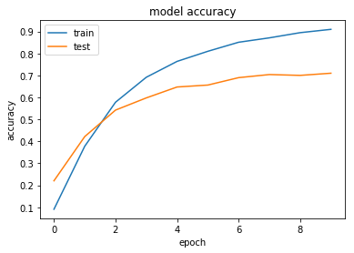
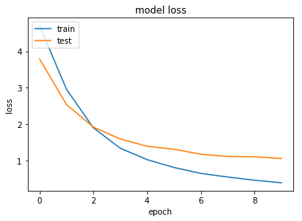
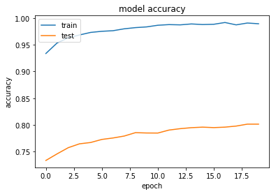
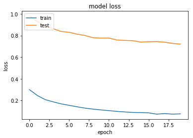

```python
import tensorflow as tf
import matplotlib.pyplot as plt
import pandas as pd
import numpy as np

%matplotlib inline
```


```python
import scipy.io as sio
import os

batch_size = 32
input_shape = (240,240)
train_dir = 'G:\\Data\\stanford-car-dataset-by-classes-folder\\car_data\\train'
test_dir = 'G:\\Data\\stanford-car-dataset-by-classes-folder\\car_data\\test'

train_datagen = tf.keras.preprocessing.image.ImageDataGenerator(
    rescale=1. / 255,
    zoom_range=0.2,  
    rotation_range = 5,
    horizontal_flip=True)

test_datagen = tf.keras.preprocessing.image.ImageDataGenerator(rescale=1. / 255)

train_generator=train_datagen.flow_from_directory(train_dir,
                                            class_mode="categorical", 
                                            target_size=input_shape, 
                                            batch_size=batch_size)


validation_generator=test_datagen.flow_from_directory(test_dir,
                                            class_mode="categorical", 
                                            target_size=input_shape, 
                                            batch_size=batch_size)

```

    Found 8144 images belonging to 196 classes.
    Found 8041 images belonging to 196 classes.
    


```python
from keras.layers import GlobalAveragePooling2D, Dense, BatchNormalization
from keras import Model
import efficientnet.keras as efn

base_model = efn.EfficientNetB1(weights='imagenet', include_top=False)
x = base_model.output
x = GlobalAveragePooling2D()(x)
predictions = Dense(len(train_generator.class_indices), activation='softmax')(x)
model = Model(inputs=base_model.input, outputs=predictions)

# fix the feature extraction part of the model
for layer in base_model.layers:
    if isinstance(layer, BatchNormalization):
        layer.trainable = True
    else:
        layer.trainable = False
        
model.compile(optimizer='adam', loss='categorical_crossentropy', metrics=['acc'])
model.summary()
```

    Using TensorFlow backend.
    

    WARNING:tensorflow:From C:\Users\chris\Anaconda3\envs\tf\lib\site-packages\tensorflow\python\framework\function.py:987: calling Graph.create_op (from tensorflow.python.framework.ops) with compute_shapes is deprecated and will be removed in a future version.
    Instructions for updating:
    Shapes are always computed; don't use the compute_shapes as it has no effect.
    __________________________________________________________________________________________________
    Layer (type)                    Output Shape         Param #     Connected to                     
    ==================================================================================================
    input_1 (InputLayer)            (None, None, None, 3 0                                            
    __________________________________________________________________________________________________
    stem_conv (Conv2D)              (None, None, None, 3 864         input_1[0][0]                    
    __________________________________________________________________________________________________
    stem_bn (BatchNormalization)    (None, None, None, 3 128         stem_conv[0][0]                  
    __________________________________________________________________________________________________
    stem_activation (Activation)    (None, None, None, 3 0           stem_bn[0][0]                    
    __________________________________________________________________________________________________
    block1a_dwconv (DepthwiseConv2D (None, None, None, 3 288         stem_activation[0][0]            
    __________________________________________________________________________________________________
    block1a_bn (BatchNormalization) (None, None, None, 3 128         block1a_dwconv[0][0]             
    __________________________________________________________________________________________________
    block1a_activation (Activation) (None, None, None, 3 0           block1a_bn[0][0]                 
    __________________________________________________________________________________________________
    block1a_se_squeeze (GlobalAvera (None, 32)           0           block1a_activation[0][0]         
    __________________________________________________________________________________________________
    block1a_se_reshape (Reshape)    (None, 1, 1, 32)     0           block1a_se_squeeze[0][0]         
    __________________________________________________________________________________________________
    block1a_se_reduce (Conv2D)      (None, 1, 1, 8)      264         block1a_se_reshape[0][0]         
    __________________________________________________________________________________________________
    block1a_se_expand (Conv2D)      (None, 1, 1, 32)     288         block1a_se_reduce[0][0]          
    __________________________________________________________________________________________________
    block1a_se_excite (Multiply)    (None, None, None, 3 0           block1a_activation[0][0]         
                                                                     block1a_se_expand[0][0]          
    __________________________________________________________________________________________________
    block1a_project_conv (Conv2D)   (None, None, None, 1 512         block1a_se_excite[0][0]          
    __________________________________________________________________________________________________
    block1a_project_bn (BatchNormal (None, None, None, 1 64          block1a_project_conv[0][0]       
    __________________________________________________________________________________________________
    block1b_dwconv (DepthwiseConv2D (None, None, None, 1 144         block1a_project_bn[0][0]         
    __________________________________________________________________________________________________
    block1b_bn (BatchNormalization) (None, None, None, 1 64          block1b_dwconv[0][0]             
    __________________________________________________________________________________________________
    block1b_activation (Activation) (None, None, None, 1 0           block1b_bn[0][0]                 
    __________________________________________________________________________________________________
    block1b_se_squeeze (GlobalAvera (None, 16)           0           block1b_activation[0][0]         
    __________________________________________________________________________________________________
    block1b_se_reshape (Reshape)    (None, 1, 1, 16)     0           block1b_se_squeeze[0][0]         
    __________________________________________________________________________________________________
    block1b_se_reduce (Conv2D)      (None, 1, 1, 4)      68          block1b_se_reshape[0][0]         
    __________________________________________________________________________________________________
    block1b_se_expand (Conv2D)      (None, 1, 1, 16)     80          block1b_se_reduce[0][0]          
    __________________________________________________________________________________________________
    block1b_se_excite (Multiply)    (None, None, None, 1 0           block1b_activation[0][0]         
                                                                     block1b_se_expand[0][0]          
    __________________________________________________________________________________________________
    block1b_project_conv (Conv2D)   (None, None, None, 1 256         block1b_se_excite[0][0]          
    __________________________________________________________________________________________________
    block1b_project_bn (BatchNormal (None, None, None, 1 64          block1b_project_conv[0][0]       
    __________________________________________________________________________________________________
    block1b_drop (FixedDropout)     (None, None, None, 1 0           block1b_project_bn[0][0]         
    __________________________________________________________________________________________________
    block1b_add (Add)               (None, None, None, 1 0           block1b_drop[0][0]               
                                                                     block1a_project_bn[0][0]         
    __________________________________________________________________________________________________
    block2a_expand_conv (Conv2D)    (None, None, None, 9 1536        block1b_add[0][0]                
    __________________________________________________________________________________________________
    block2a_expand_bn (BatchNormali (None, None, None, 9 384         block2a_expand_conv[0][0]        
    __________________________________________________________________________________________________
    block2a_expand_activation (Acti (None, None, None, 9 0           block2a_expand_bn[0][0]          
    __________________________________________________________________________________________________
    block2a_dwconv (DepthwiseConv2D (None, None, None, 9 864         block2a_expand_activation[0][0]  
    __________________________________________________________________________________________________
    block2a_bn (BatchNormalization) (None, None, None, 9 384         block2a_dwconv[0][0]             
    __________________________________________________________________________________________________
    block2a_activation (Activation) (None, None, None, 9 0           block2a_bn[0][0]                 
    __________________________________________________________________________________________________
    block2a_se_squeeze (GlobalAvera (None, 96)           0           block2a_activation[0][0]         
    __________________________________________________________________________________________________
    block2a_se_reshape (Reshape)    (None, 1, 1, 96)     0           block2a_se_squeeze[0][0]         
    __________________________________________________________________________________________________
    block2a_se_reduce (Conv2D)      (None, 1, 1, 4)      388         block2a_se_reshape[0][0]         
    __________________________________________________________________________________________________
    block2a_se_expand (Conv2D)      (None, 1, 1, 96)     480         block2a_se_reduce[0][0]          
    __________________________________________________________________________________________________
    block2a_se_excite (Multiply)    (None, None, None, 9 0           block2a_activation[0][0]         
                                                                     block2a_se_expand[0][0]          
    __________________________________________________________________________________________________
    block2a_project_conv (Conv2D)   (None, None, None, 2 2304        block2a_se_excite[0][0]          
    __________________________________________________________________________________________________
    block2a_project_bn (BatchNormal (None, None, None, 2 96          block2a_project_conv[0][0]       
    __________________________________________________________________________________________________
    block2b_expand_conv (Conv2D)    (None, None, None, 1 3456        block2a_project_bn[0][0]         
    __________________________________________________________________________________________________
    block2b_expand_bn (BatchNormali (None, None, None, 1 576         block2b_expand_conv[0][0]        
    __________________________________________________________________________________________________
    block2b_expand_activation (Acti (None, None, None, 1 0           block2b_expand_bn[0][0]          
    __________________________________________________________________________________________________
    block2b_dwconv (DepthwiseConv2D (None, None, None, 1 1296        block2b_expand_activation[0][0]  
    __________________________________________________________________________________________________
    block2b_bn (BatchNormalization) (None, None, None, 1 576         block2b_dwconv[0][0]             
    __________________________________________________________________________________________________
    block2b_activation (Activation) (None, None, None, 1 0           block2b_bn[0][0]                 
    __________________________________________________________________________________________________
    block2b_se_squeeze (GlobalAvera (None, 144)          0           block2b_activation[0][0]         
    __________________________________________________________________________________________________
    block2b_se_reshape (Reshape)    (None, 1, 1, 144)    0           block2b_se_squeeze[0][0]         
    __________________________________________________________________________________________________
    block2b_se_reduce (Conv2D)      (None, 1, 1, 6)      870         block2b_se_reshape[0][0]         
    __________________________________________________________________________________________________
    block2b_se_expand (Conv2D)      (None, 1, 1, 144)    1008        block2b_se_reduce[0][0]          
    __________________________________________________________________________________________________
    block2b_se_excite (Multiply)    (None, None, None, 1 0           block2b_activation[0][0]         
                                                                     block2b_se_expand[0][0]          
    __________________________________________________________________________________________________
    block2b_project_conv (Conv2D)   (None, None, None, 2 3456        block2b_se_excite[0][0]          
    __________________________________________________________________________________________________
    block2b_project_bn (BatchNormal (None, None, None, 2 96          block2b_project_conv[0][0]       
    __________________________________________________________________________________________________
    block2b_drop (FixedDropout)     (None, None, None, 2 0           block2b_project_bn[0][0]         
    __________________________________________________________________________________________________
    block2b_add (Add)               (None, None, None, 2 0           block2b_drop[0][0]               
                                                                     block2a_project_bn[0][0]         
    __________________________________________________________________________________________________
    block2c_expand_conv (Conv2D)    (None, None, None, 1 3456        block2b_add[0][0]                
    __________________________________________________________________________________________________
    block2c_expand_bn (BatchNormali (None, None, None, 1 576         block2c_expand_conv[0][0]        
    __________________________________________________________________________________________________
    block2c_expand_activation (Acti (None, None, None, 1 0           block2c_expand_bn[0][0]          
    __________________________________________________________________________________________________
    block2c_dwconv (DepthwiseConv2D (None, None, None, 1 1296        block2c_expand_activation[0][0]  
    __________________________________________________________________________________________________
    block2c_bn (BatchNormalization) (None, None, None, 1 576         block2c_dwconv[0][0]             
    __________________________________________________________________________________________________
    block2c_activation (Activation) (None, None, None, 1 0           block2c_bn[0][0]                 
    __________________________________________________________________________________________________
    block2c_se_squeeze (GlobalAvera (None, 144)          0           block2c_activation[0][0]         
    __________________________________________________________________________________________________
    block2c_se_reshape (Reshape)    (None, 1, 1, 144)    0           block2c_se_squeeze[0][0]         
    __________________________________________________________________________________________________
    block2c_se_reduce (Conv2D)      (None, 1, 1, 6)      870         block2c_se_reshape[0][0]         
    __________________________________________________________________________________________________
    block2c_se_expand (Conv2D)      (None, 1, 1, 144)    1008        block2c_se_reduce[0][0]          
    __________________________________________________________________________________________________
    block2c_se_excite (Multiply)    (None, None, None, 1 0           block2c_activation[0][0]         
                                                                     block2c_se_expand[0][0]          
    __________________________________________________________________________________________________
    block2c_project_conv (Conv2D)   (None, None, None, 2 3456        block2c_se_excite[0][0]          
    __________________________________________________________________________________________________
    block2c_project_bn (BatchNormal (None, None, None, 2 96          block2c_project_conv[0][0]       
    __________________________________________________________________________________________________
    block2c_drop (FixedDropout)     (None, None, None, 2 0           block2c_project_bn[0][0]         
    __________________________________________________________________________________________________
    block2c_add (Add)               (None, None, None, 2 0           block2c_drop[0][0]               
                                                                     block2b_add[0][0]                
    __________________________________________________________________________________________________
    block3a_expand_conv (Conv2D)    (None, None, None, 1 3456        block2c_add[0][0]                
    __________________________________________________________________________________________________
    block3a_expand_bn (BatchNormali (None, None, None, 1 576         block3a_expand_conv[0][0]        
    __________________________________________________________________________________________________
    block3a_expand_activation (Acti (None, None, None, 1 0           block3a_expand_bn[0][0]          
    __________________________________________________________________________________________________
    block3a_dwconv (DepthwiseConv2D (None, None, None, 1 3600        block3a_expand_activation[0][0]  
    __________________________________________________________________________________________________
    block3a_bn (BatchNormalization) (None, None, None, 1 576         block3a_dwconv[0][0]             
    __________________________________________________________________________________________________
    block3a_activation (Activation) (None, None, None, 1 0           block3a_bn[0][0]                 
    __________________________________________________________________________________________________
    block3a_se_squeeze (GlobalAvera (None, 144)          0           block3a_activation[0][0]         
    __________________________________________________________________________________________________
    block3a_se_reshape (Reshape)    (None, 1, 1, 144)    0           block3a_se_squeeze[0][0]         
    __________________________________________________________________________________________________
    block3a_se_reduce (Conv2D)      (None, 1, 1, 6)      870         block3a_se_reshape[0][0]         
    __________________________________________________________________________________________________
    block3a_se_expand (Conv2D)      (None, 1, 1, 144)    1008        block3a_se_reduce[0][0]          
    __________________________________________________________________________________________________
    block3a_se_excite (Multiply)    (None, None, None, 1 0           block3a_activation[0][0]         
                                                                     block3a_se_expand[0][0]          
    __________________________________________________________________________________________________
    block3a_project_conv (Conv2D)   (None, None, None, 4 5760        block3a_se_excite[0][0]          
    __________________________________________________________________________________________________
    block3a_project_bn (BatchNormal (None, None, None, 4 160         block3a_project_conv[0][0]       
    __________________________________________________________________________________________________
    block3b_expand_conv (Conv2D)    (None, None, None, 2 9600        block3a_project_bn[0][0]         
    __________________________________________________________________________________________________
    block3b_expand_bn (BatchNormali (None, None, None, 2 960         block3b_expand_conv[0][0]        
    __________________________________________________________________________________________________
    block3b_expand_activation (Acti (None, None, None, 2 0           block3b_expand_bn[0][0]          
    __________________________________________________________________________________________________
    block3b_dwconv (DepthwiseConv2D (None, None, None, 2 6000        block3b_expand_activation[0][0]  
    __________________________________________________________________________________________________
    block3b_bn (BatchNormalization) (None, None, None, 2 960         block3b_dwconv[0][0]             
    __________________________________________________________________________________________________
    block3b_activation (Activation) (None, None, None, 2 0           block3b_bn[0][0]                 
    __________________________________________________________________________________________________
    block3b_se_squeeze (GlobalAvera (None, 240)          0           block3b_activation[0][0]         
    __________________________________________________________________________________________________
    block3b_se_reshape (Reshape)    (None, 1, 1, 240)    0           block3b_se_squeeze[0][0]         
    __________________________________________________________________________________________________
    block3b_se_reduce (Conv2D)      (None, 1, 1, 10)     2410        block3b_se_reshape[0][0]         
    __________________________________________________________________________________________________
    block3b_se_expand (Conv2D)      (None, 1, 1, 240)    2640        block3b_se_reduce[0][0]          
    __________________________________________________________________________________________________
    block3b_se_excite (Multiply)    (None, None, None, 2 0           block3b_activation[0][0]         
                                                                     block3b_se_expand[0][0]          
    __________________________________________________________________________________________________
    block3b_project_conv (Conv2D)   (None, None, None, 4 9600        block3b_se_excite[0][0]          
    __________________________________________________________________________________________________
    block3b_project_bn (BatchNormal (None, None, None, 4 160         block3b_project_conv[0][0]       
    __________________________________________________________________________________________________
    block3b_drop (FixedDropout)     (None, None, None, 4 0           block3b_project_bn[0][0]         
    __________________________________________________________________________________________________
    block3b_add (Add)               (None, None, None, 4 0           block3b_drop[0][0]               
                                                                     block3a_project_bn[0][0]         
    __________________________________________________________________________________________________
    block3c_expand_conv (Conv2D)    (None, None, None, 2 9600        block3b_add[0][0]                
    __________________________________________________________________________________________________
    block3c_expand_bn (BatchNormali (None, None, None, 2 960         block3c_expand_conv[0][0]        
    __________________________________________________________________________________________________
    block3c_expand_activation (Acti (None, None, None, 2 0           block3c_expand_bn[0][0]          
    __________________________________________________________________________________________________
    block3c_dwconv (DepthwiseConv2D (None, None, None, 2 6000        block3c_expand_activation[0][0]  
    __________________________________________________________________________________________________
    block3c_bn (BatchNormalization) (None, None, None, 2 960         block3c_dwconv[0][0]             
    __________________________________________________________________________________________________
    block3c_activation (Activation) (None, None, None, 2 0           block3c_bn[0][0]                 
    __________________________________________________________________________________________________
    block3c_se_squeeze (GlobalAvera (None, 240)          0           block3c_activation[0][0]         
    __________________________________________________________________________________________________
    block3c_se_reshape (Reshape)    (None, 1, 1, 240)    0           block3c_se_squeeze[0][0]         
    __________________________________________________________________________________________________
    block3c_se_reduce (Conv2D)      (None, 1, 1, 10)     2410        block3c_se_reshape[0][0]         
    __________________________________________________________________________________________________
    block3c_se_expand (Conv2D)      (None, 1, 1, 240)    2640        block3c_se_reduce[0][0]          
    __________________________________________________________________________________________________
    block3c_se_excite (Multiply)    (None, None, None, 2 0           block3c_activation[0][0]         
                                                                     block3c_se_expand[0][0]          
    __________________________________________________________________________________________________
    block3c_project_conv (Conv2D)   (None, None, None, 4 9600        block3c_se_excite[0][0]          
    __________________________________________________________________________________________________
    block3c_project_bn (BatchNormal (None, None, None, 4 160         block3c_project_conv[0][0]       
    __________________________________________________________________________________________________
    block3c_drop (FixedDropout)     (None, None, None, 4 0           block3c_project_bn[0][0]         
    __________________________________________________________________________________________________
    block3c_add (Add)               (None, None, None, 4 0           block3c_drop[0][0]               
                                                                     block3b_add[0][0]                
    __________________________________________________________________________________________________
    block4a_expand_conv (Conv2D)    (None, None, None, 2 9600        block3c_add[0][0]                
    __________________________________________________________________________________________________
    block4a_expand_bn (BatchNormali (None, None, None, 2 960         block4a_expand_conv[0][0]        
    __________________________________________________________________________________________________
    block4a_expand_activation (Acti (None, None, None, 2 0           block4a_expand_bn[0][0]          
    __________________________________________________________________________________________________
    block4a_dwconv (DepthwiseConv2D (None, None, None, 2 2160        block4a_expand_activation[0][0]  
    __________________________________________________________________________________________________
    block4a_bn (BatchNormalization) (None, None, None, 2 960         block4a_dwconv[0][0]             
    __________________________________________________________________________________________________
    block4a_activation (Activation) (None, None, None, 2 0           block4a_bn[0][0]                 
    __________________________________________________________________________________________________
    block4a_se_squeeze (GlobalAvera (None, 240)          0           block4a_activation[0][0]         
    __________________________________________________________________________________________________
    block4a_se_reshape (Reshape)    (None, 1, 1, 240)    0           block4a_se_squeeze[0][0]         
    __________________________________________________________________________________________________
    block4a_se_reduce (Conv2D)      (None, 1, 1, 10)     2410        block4a_se_reshape[0][0]         
    __________________________________________________________________________________________________
    block4a_se_expand (Conv2D)      (None, 1, 1, 240)    2640        block4a_se_reduce[0][0]          
    __________________________________________________________________________________________________
    block4a_se_excite (Multiply)    (None, None, None, 2 0           block4a_activation[0][0]         
                                                                     block4a_se_expand[0][0]          
    __________________________________________________________________________________________________
    block4a_project_conv (Conv2D)   (None, None, None, 8 19200       block4a_se_excite[0][0]          
    __________________________________________________________________________________________________
    block4a_project_bn (BatchNormal (None, None, None, 8 320         block4a_project_conv[0][0]       
    __________________________________________________________________________________________________
    block4b_expand_conv (Conv2D)    (None, None, None, 4 38400       block4a_project_bn[0][0]         
    __________________________________________________________________________________________________
    block4b_expand_bn (BatchNormali (None, None, None, 4 1920        block4b_expand_conv[0][0]        
    __________________________________________________________________________________________________
    block4b_expand_activation (Acti (None, None, None, 4 0           block4b_expand_bn[0][0]          
    __________________________________________________________________________________________________
    block4b_dwconv (DepthwiseConv2D (None, None, None, 4 4320        block4b_expand_activation[0][0]  
    __________________________________________________________________________________________________
    block4b_bn (BatchNormalization) (None, None, None, 4 1920        block4b_dwconv[0][0]             
    __________________________________________________________________________________________________
    block4b_activation (Activation) (None, None, None, 4 0           block4b_bn[0][0]                 
    __________________________________________________________________________________________________
    block4b_se_squeeze (GlobalAvera (None, 480)          0           block4b_activation[0][0]         
    __________________________________________________________________________________________________
    block4b_se_reshape (Reshape)    (None, 1, 1, 480)    0           block4b_se_squeeze[0][0]         
    __________________________________________________________________________________________________
    block4b_se_reduce (Conv2D)      (None, 1, 1, 20)     9620        block4b_se_reshape[0][0]         
    __________________________________________________________________________________________________
    block4b_se_expand (Conv2D)      (None, 1, 1, 480)    10080       block4b_se_reduce[0][0]          
    __________________________________________________________________________________________________
    block4b_se_excite (Multiply)    (None, None, None, 4 0           block4b_activation[0][0]         
                                                                     block4b_se_expand[0][0]          
    __________________________________________________________________________________________________
    block4b_project_conv (Conv2D)   (None, None, None, 8 38400       block4b_se_excite[0][0]          
    __________________________________________________________________________________________________
    block4b_project_bn (BatchNormal (None, None, None, 8 320         block4b_project_conv[0][0]       
    __________________________________________________________________________________________________
    block4b_drop (FixedDropout)     (None, None, None, 8 0           block4b_project_bn[0][0]         
    __________________________________________________________________________________________________
    block4b_add (Add)               (None, None, None, 8 0           block4b_drop[0][0]               
                                                                     block4a_project_bn[0][0]         
    __________________________________________________________________________________________________
    block4c_expand_conv (Conv2D)    (None, None, None, 4 38400       block4b_add[0][0]                
    __________________________________________________________________________________________________
    block4c_expand_bn (BatchNormali (None, None, None, 4 1920        block4c_expand_conv[0][0]        
    __________________________________________________________________________________________________
    block4c_expand_activation (Acti (None, None, None, 4 0           block4c_expand_bn[0][0]          
    __________________________________________________________________________________________________
    block4c_dwconv (DepthwiseConv2D (None, None, None, 4 4320        block4c_expand_activation[0][0]  
    __________________________________________________________________________________________________
    block4c_bn (BatchNormalization) (None, None, None, 4 1920        block4c_dwconv[0][0]             
    __________________________________________________________________________________________________
    block4c_activation (Activation) (None, None, None, 4 0           block4c_bn[0][0]                 
    __________________________________________________________________________________________________
    block4c_se_squeeze (GlobalAvera (None, 480)          0           block4c_activation[0][0]         
    __________________________________________________________________________________________________
    block4c_se_reshape (Reshape)    (None, 1, 1, 480)    0           block4c_se_squeeze[0][0]         
    __________________________________________________________________________________________________
    block4c_se_reduce (Conv2D)      (None, 1, 1, 20)     9620        block4c_se_reshape[0][0]         
    __________________________________________________________________________________________________
    block4c_se_expand (Conv2D)      (None, 1, 1, 480)    10080       block4c_se_reduce[0][0]          
    __________________________________________________________________________________________________
    block4c_se_excite (Multiply)    (None, None, None, 4 0           block4c_activation[0][0]         
                                                                     block4c_se_expand[0][0]          
    __________________________________________________________________________________________________
    block4c_project_conv (Conv2D)   (None, None, None, 8 38400       block4c_se_excite[0][0]          
    __________________________________________________________________________________________________
    block4c_project_bn (BatchNormal (None, None, None, 8 320         block4c_project_conv[0][0]       
    __________________________________________________________________________________________________
    block4c_drop (FixedDropout)     (None, None, None, 8 0           block4c_project_bn[0][0]         
    __________________________________________________________________________________________________
    block4c_add (Add)               (None, None, None, 8 0           block4c_drop[0][0]               
                                                                     block4b_add[0][0]                
    __________________________________________________________________________________________________
    block4d_expand_conv (Conv2D)    (None, None, None, 4 38400       block4c_add[0][0]                
    __________________________________________________________________________________________________
    block4d_expand_bn (BatchNormali (None, None, None, 4 1920        block4d_expand_conv[0][0]        
    __________________________________________________________________________________________________
    block4d_expand_activation (Acti (None, None, None, 4 0           block4d_expand_bn[0][0]          
    __________________________________________________________________________________________________
    block4d_dwconv (DepthwiseConv2D (None, None, None, 4 4320        block4d_expand_activation[0][0]  
    __________________________________________________________________________________________________
    block4d_bn (BatchNormalization) (None, None, None, 4 1920        block4d_dwconv[0][0]             
    __________________________________________________________________________________________________
    block4d_activation (Activation) (None, None, None, 4 0           block4d_bn[0][0]                 
    __________________________________________________________________________________________________
    block4d_se_squeeze (GlobalAvera (None, 480)          0           block4d_activation[0][0]         
    __________________________________________________________________________________________________
    block4d_se_reshape (Reshape)    (None, 1, 1, 480)    0           block4d_se_squeeze[0][0]         
    __________________________________________________________________________________________________
    block4d_se_reduce (Conv2D)      (None, 1, 1, 20)     9620        block4d_se_reshape[0][0]         
    __________________________________________________________________________________________________
    block4d_se_expand (Conv2D)      (None, 1, 1, 480)    10080       block4d_se_reduce[0][0]          
    __________________________________________________________________________________________________
    block4d_se_excite (Multiply)    (None, None, None, 4 0           block4d_activation[0][0]         
                                                                     block4d_se_expand[0][0]          
    __________________________________________________________________________________________________
    block4d_project_conv (Conv2D)   (None, None, None, 8 38400       block4d_se_excite[0][0]          
    __________________________________________________________________________________________________
    block4d_project_bn (BatchNormal (None, None, None, 8 320         block4d_project_conv[0][0]       
    __________________________________________________________________________________________________
    block4d_drop (FixedDropout)     (None, None, None, 8 0           block4d_project_bn[0][0]         
    __________________________________________________________________________________________________
    block4d_add (Add)               (None, None, None, 8 0           block4d_drop[0][0]               
                                                                     block4c_add[0][0]                
    __________________________________________________________________________________________________
    block5a_expand_conv (Conv2D)    (None, None, None, 4 38400       block4d_add[0][0]                
    __________________________________________________________________________________________________
    block5a_expand_bn (BatchNormali (None, None, None, 4 1920        block5a_expand_conv[0][0]        
    __________________________________________________________________________________________________
    block5a_expand_activation (Acti (None, None, None, 4 0           block5a_expand_bn[0][0]          
    __________________________________________________________________________________________________
    block5a_dwconv (DepthwiseConv2D (None, None, None, 4 12000       block5a_expand_activation[0][0]  
    __________________________________________________________________________________________________
    block5a_bn (BatchNormalization) (None, None, None, 4 1920        block5a_dwconv[0][0]             
    __________________________________________________________________________________________________
    block5a_activation (Activation) (None, None, None, 4 0           block5a_bn[0][0]                 
    __________________________________________________________________________________________________
    block5a_se_squeeze (GlobalAvera (None, 480)          0           block5a_activation[0][0]         
    __________________________________________________________________________________________________
    block5a_se_reshape (Reshape)    (None, 1, 1, 480)    0           block5a_se_squeeze[0][0]         
    __________________________________________________________________________________________________
    block5a_se_reduce (Conv2D)      (None, 1, 1, 20)     9620        block5a_se_reshape[0][0]         
    __________________________________________________________________________________________________
    block5a_se_expand (Conv2D)      (None, 1, 1, 480)    10080       block5a_se_reduce[0][0]          
    __________________________________________________________________________________________________
    block5a_se_excite (Multiply)    (None, None, None, 4 0           block5a_activation[0][0]         
                                                                     block5a_se_expand[0][0]          
    __________________________________________________________________________________________________
    block5a_project_conv (Conv2D)   (None, None, None, 1 53760       block5a_se_excite[0][0]          
    __________________________________________________________________________________________________
    block5a_project_bn (BatchNormal (None, None, None, 1 448         block5a_project_conv[0][0]       
    __________________________________________________________________________________________________
    block5b_expand_conv (Conv2D)    (None, None, None, 6 75264       block5a_project_bn[0][0]         
    __________________________________________________________________________________________________
    block5b_expand_bn (BatchNormali (None, None, None, 6 2688        block5b_expand_conv[0][0]        
    __________________________________________________________________________________________________
    block5b_expand_activation (Acti (None, None, None, 6 0           block5b_expand_bn[0][0]          
    __________________________________________________________________________________________________
    block5b_dwconv (DepthwiseConv2D (None, None, None, 6 16800       block5b_expand_activation[0][0]  
    __________________________________________________________________________________________________
    block5b_bn (BatchNormalization) (None, None, None, 6 2688        block5b_dwconv[0][0]             
    __________________________________________________________________________________________________
    block5b_activation (Activation) (None, None, None, 6 0           block5b_bn[0][0]                 
    __________________________________________________________________________________________________
    block5b_se_squeeze (GlobalAvera (None, 672)          0           block5b_activation[0][0]         
    __________________________________________________________________________________________________
    block5b_se_reshape (Reshape)    (None, 1, 1, 672)    0           block5b_se_squeeze[0][0]         
    __________________________________________________________________________________________________
    block5b_se_reduce (Conv2D)      (None, 1, 1, 28)     18844       block5b_se_reshape[0][0]         
    __________________________________________________________________________________________________
    block5b_se_expand (Conv2D)      (None, 1, 1, 672)    19488       block5b_se_reduce[0][0]          
    __________________________________________________________________________________________________
    block5b_se_excite (Multiply)    (None, None, None, 6 0           block5b_activation[0][0]         
                                                                     block5b_se_expand[0][0]          
    __________________________________________________________________________________________________
    block5b_project_conv (Conv2D)   (None, None, None, 1 75264       block5b_se_excite[0][0]          
    __________________________________________________________________________________________________
    block5b_project_bn (BatchNormal (None, None, None, 1 448         block5b_project_conv[0][0]       
    __________________________________________________________________________________________________
    block5b_drop (FixedDropout)     (None, None, None, 1 0           block5b_project_bn[0][0]         
    __________________________________________________________________________________________________
    block5b_add (Add)               (None, None, None, 1 0           block5b_drop[0][0]               
                                                                     block5a_project_bn[0][0]         
    __________________________________________________________________________________________________
    block5c_expand_conv (Conv2D)    (None, None, None, 6 75264       block5b_add[0][0]                
    __________________________________________________________________________________________________
    block5c_expand_bn (BatchNormali (None, None, None, 6 2688        block5c_expand_conv[0][0]        
    __________________________________________________________________________________________________
    block5c_expand_activation (Acti (None, None, None, 6 0           block5c_expand_bn[0][0]          
    __________________________________________________________________________________________________
    block5c_dwconv (DepthwiseConv2D (None, None, None, 6 16800       block5c_expand_activation[0][0]  
    __________________________________________________________________________________________________
    block5c_bn (BatchNormalization) (None, None, None, 6 2688        block5c_dwconv[0][0]             
    __________________________________________________________________________________________________
    block5c_activation (Activation) (None, None, None, 6 0           block5c_bn[0][0]                 
    __________________________________________________________________________________________________
    block5c_se_squeeze (GlobalAvera (None, 672)          0           block5c_activation[0][0]         
    __________________________________________________________________________________________________
    block5c_se_reshape (Reshape)    (None, 1, 1, 672)    0           block5c_se_squeeze[0][0]         
    __________________________________________________________________________________________________
    block5c_se_reduce (Conv2D)      (None, 1, 1, 28)     18844       block5c_se_reshape[0][0]         
    __________________________________________________________________________________________________
    block5c_se_expand (Conv2D)      (None, 1, 1, 672)    19488       block5c_se_reduce[0][0]          
    __________________________________________________________________________________________________
    block5c_se_excite (Multiply)    (None, None, None, 6 0           block5c_activation[0][0]         
                                                                     block5c_se_expand[0][0]          
    __________________________________________________________________________________________________
    block5c_project_conv (Conv2D)   (None, None, None, 1 75264       block5c_se_excite[0][0]          
    __________________________________________________________________________________________________
    block5c_project_bn (BatchNormal (None, None, None, 1 448         block5c_project_conv[0][0]       
    __________________________________________________________________________________________________
    block5c_drop (FixedDropout)     (None, None, None, 1 0           block5c_project_bn[0][0]         
    __________________________________________________________________________________________________
    block5c_add (Add)               (None, None, None, 1 0           block5c_drop[0][0]               
                                                                     block5b_add[0][0]                
    __________________________________________________________________________________________________
    block5d_expand_conv (Conv2D)    (None, None, None, 6 75264       block5c_add[0][0]                
    __________________________________________________________________________________________________
    block5d_expand_bn (BatchNormali (None, None, None, 6 2688        block5d_expand_conv[0][0]        
    __________________________________________________________________________________________________
    block5d_expand_activation (Acti (None, None, None, 6 0           block5d_expand_bn[0][0]          
    __________________________________________________________________________________________________
    block5d_dwconv (DepthwiseConv2D (None, None, None, 6 16800       block5d_expand_activation[0][0]  
    __________________________________________________________________________________________________
    block5d_bn (BatchNormalization) (None, None, None, 6 2688        block5d_dwconv[0][0]             
    __________________________________________________________________________________________________
    block5d_activation (Activation) (None, None, None, 6 0           block5d_bn[0][0]                 
    __________________________________________________________________________________________________
    block5d_se_squeeze (GlobalAvera (None, 672)          0           block5d_activation[0][0]         
    __________________________________________________________________________________________________
    block5d_se_reshape (Reshape)    (None, 1, 1, 672)    0           block5d_se_squeeze[0][0]         
    __________________________________________________________________________________________________
    block5d_se_reduce (Conv2D)      (None, 1, 1, 28)     18844       block5d_se_reshape[0][0]         
    __________________________________________________________________________________________________
    block5d_se_expand (Conv2D)      (None, 1, 1, 672)    19488       block5d_se_reduce[0][0]          
    __________________________________________________________________________________________________
    block5d_se_excite (Multiply)    (None, None, None, 6 0           block5d_activation[0][0]         
                                                                     block5d_se_expand[0][0]          
    __________________________________________________________________________________________________
    block5d_project_conv (Conv2D)   (None, None, None, 1 75264       block5d_se_excite[0][0]          
    __________________________________________________________________________________________________
    block5d_project_bn (BatchNormal (None, None, None, 1 448         block5d_project_conv[0][0]       
    __________________________________________________________________________________________________
    block5d_drop (FixedDropout)     (None, None, None, 1 0           block5d_project_bn[0][0]         
    __________________________________________________________________________________________________
    block5d_add (Add)               (None, None, None, 1 0           block5d_drop[0][0]               
                                                                     block5c_add[0][0]                
    __________________________________________________________________________________________________
    block6a_expand_conv (Conv2D)    (None, None, None, 6 75264       block5d_add[0][0]                
    __________________________________________________________________________________________________
    block6a_expand_bn (BatchNormali (None, None, None, 6 2688        block6a_expand_conv[0][0]        
    __________________________________________________________________________________________________
    block6a_expand_activation (Acti (None, None, None, 6 0           block6a_expand_bn[0][0]          
    __________________________________________________________________________________________________
    block6a_dwconv (DepthwiseConv2D (None, None, None, 6 16800       block6a_expand_activation[0][0]  
    __________________________________________________________________________________________________
    block6a_bn (BatchNormalization) (None, None, None, 6 2688        block6a_dwconv[0][0]             
    __________________________________________________________________________________________________
    block6a_activation (Activation) (None, None, None, 6 0           block6a_bn[0][0]                 
    __________________________________________________________________________________________________
    block6a_se_squeeze (GlobalAvera (None, 672)          0           block6a_activation[0][0]         
    __________________________________________________________________________________________________
    block6a_se_reshape (Reshape)    (None, 1, 1, 672)    0           block6a_se_squeeze[0][0]         
    __________________________________________________________________________________________________
    block6a_se_reduce (Conv2D)      (None, 1, 1, 28)     18844       block6a_se_reshape[0][0]         
    __________________________________________________________________________________________________
    block6a_se_expand (Conv2D)      (None, 1, 1, 672)    19488       block6a_se_reduce[0][0]          
    __________________________________________________________________________________________________
    block6a_se_excite (Multiply)    (None, None, None, 6 0           block6a_activation[0][0]         
                                                                     block6a_se_expand[0][0]          
    __________________________________________________________________________________________________
    block6a_project_conv (Conv2D)   (None, None, None, 1 129024      block6a_se_excite[0][0]          
    __________________________________________________________________________________________________
    block6a_project_bn (BatchNormal (None, None, None, 1 768         block6a_project_conv[0][0]       
    __________________________________________________________________________________________________
    block6b_expand_conv (Conv2D)    (None, None, None, 1 221184      block6a_project_bn[0][0]         
    __________________________________________________________________________________________________
    block6b_expand_bn (BatchNormali (None, None, None, 1 4608        block6b_expand_conv[0][0]        
    __________________________________________________________________________________________________
    block6b_expand_activation (Acti (None, None, None, 1 0           block6b_expand_bn[0][0]          
    __________________________________________________________________________________________________
    block6b_dwconv (DepthwiseConv2D (None, None, None, 1 28800       block6b_expand_activation[0][0]  
    __________________________________________________________________________________________________
    block6b_bn (BatchNormalization) (None, None, None, 1 4608        block6b_dwconv[0][0]             
    __________________________________________________________________________________________________
    block6b_activation (Activation) (None, None, None, 1 0           block6b_bn[0][0]                 
    __________________________________________________________________________________________________
    block6b_se_squeeze (GlobalAvera (None, 1152)         0           block6b_activation[0][0]         
    __________________________________________________________________________________________________
    block6b_se_reshape (Reshape)    (None, 1, 1, 1152)   0           block6b_se_squeeze[0][0]         
    __________________________________________________________________________________________________
    block6b_se_reduce (Conv2D)      (None, 1, 1, 48)     55344       block6b_se_reshape[0][0]         
    __________________________________________________________________________________________________
    block6b_se_expand (Conv2D)      (None, 1, 1, 1152)   56448       block6b_se_reduce[0][0]          
    __________________________________________________________________________________________________
    block6b_se_excite (Multiply)    (None, None, None, 1 0           block6b_activation[0][0]         
                                                                     block6b_se_expand[0][0]          
    __________________________________________________________________________________________________
    block6b_project_conv (Conv2D)   (None, None, None, 1 221184      block6b_se_excite[0][0]          
    __________________________________________________________________________________________________
    block6b_project_bn (BatchNormal (None, None, None, 1 768         block6b_project_conv[0][0]       
    __________________________________________________________________________________________________
    block6b_drop (FixedDropout)     (None, None, None, 1 0           block6b_project_bn[0][0]         
    __________________________________________________________________________________________________
    block6b_add (Add)               (None, None, None, 1 0           block6b_drop[0][0]               
                                                                     block6a_project_bn[0][0]         
    __________________________________________________________________________________________________
    block6c_expand_conv (Conv2D)    (None, None, None, 1 221184      block6b_add[0][0]                
    __________________________________________________________________________________________________
    block6c_expand_bn (BatchNormali (None, None, None, 1 4608        block6c_expand_conv[0][0]        
    __________________________________________________________________________________________________
    block6c_expand_activation (Acti (None, None, None, 1 0           block6c_expand_bn[0][0]          
    __________________________________________________________________________________________________
    block6c_dwconv (DepthwiseConv2D (None, None, None, 1 28800       block6c_expand_activation[0][0]  
    __________________________________________________________________________________________________
    block6c_bn (BatchNormalization) (None, None, None, 1 4608        block6c_dwconv[0][0]             
    __________________________________________________________________________________________________
    block6c_activation (Activation) (None, None, None, 1 0           block6c_bn[0][0]                 
    __________________________________________________________________________________________________
    block6c_se_squeeze (GlobalAvera (None, 1152)         0           block6c_activation[0][0]         
    __________________________________________________________________________________________________
    block6c_se_reshape (Reshape)    (None, 1, 1, 1152)   0           block6c_se_squeeze[0][0]         
    __________________________________________________________________________________________________
    block6c_se_reduce (Conv2D)      (None, 1, 1, 48)     55344       block6c_se_reshape[0][0]         
    __________________________________________________________________________________________________
    block6c_se_expand (Conv2D)      (None, 1, 1, 1152)   56448       block6c_se_reduce[0][0]          
    __________________________________________________________________________________________________
    block6c_se_excite (Multiply)    (None, None, None, 1 0           block6c_activation[0][0]         
                                                                     block6c_se_expand[0][0]          
    __________________________________________________________________________________________________
    block6c_project_conv (Conv2D)   (None, None, None, 1 221184      block6c_se_excite[0][0]          
    __________________________________________________________________________________________________
    block6c_project_bn (BatchNormal (None, None, None, 1 768         block6c_project_conv[0][0]       
    __________________________________________________________________________________________________
    block6c_drop (FixedDropout)     (None, None, None, 1 0           block6c_project_bn[0][0]         
    __________________________________________________________________________________________________
    block6c_add (Add)               (None, None, None, 1 0           block6c_drop[0][0]               
                                                                     block6b_add[0][0]                
    __________________________________________________________________________________________________
    block6d_expand_conv (Conv2D)    (None, None, None, 1 221184      block6c_add[0][0]                
    __________________________________________________________________________________________________
    block6d_expand_bn (BatchNormali (None, None, None, 1 4608        block6d_expand_conv[0][0]        
    __________________________________________________________________________________________________
    block6d_expand_activation (Acti (None, None, None, 1 0           block6d_expand_bn[0][0]          
    __________________________________________________________________________________________________
    block6d_dwconv (DepthwiseConv2D (None, None, None, 1 28800       block6d_expand_activation[0][0]  
    __________________________________________________________________________________________________
    block6d_bn (BatchNormalization) (None, None, None, 1 4608        block6d_dwconv[0][0]             
    __________________________________________________________________________________________________
    block6d_activation (Activation) (None, None, None, 1 0           block6d_bn[0][0]                 
    __________________________________________________________________________________________________
    block6d_se_squeeze (GlobalAvera (None, 1152)         0           block6d_activation[0][0]         
    __________________________________________________________________________________________________
    block6d_se_reshape (Reshape)    (None, 1, 1, 1152)   0           block6d_se_squeeze[0][0]         
    __________________________________________________________________________________________________
    block6d_se_reduce (Conv2D)      (None, 1, 1, 48)     55344       block6d_se_reshape[0][0]         
    __________________________________________________________________________________________________
    block6d_se_expand (Conv2D)      (None, 1, 1, 1152)   56448       block6d_se_reduce[0][0]          
    __________________________________________________________________________________________________
    block6d_se_excite (Multiply)    (None, None, None, 1 0           block6d_activation[0][0]         
                                                                     block6d_se_expand[0][0]          
    __________________________________________________________________________________________________
    block6d_project_conv (Conv2D)   (None, None, None, 1 221184      block6d_se_excite[0][0]          
    __________________________________________________________________________________________________
    block6d_project_bn (BatchNormal (None, None, None, 1 768         block6d_project_conv[0][0]       
    __________________________________________________________________________________________________
    block6d_drop (FixedDropout)     (None, None, None, 1 0           block6d_project_bn[0][0]         
    __________________________________________________________________________________________________
    block6d_add (Add)               (None, None, None, 1 0           block6d_drop[0][0]               
                                                                     block6c_add[0][0]                
    __________________________________________________________________________________________________
    block6e_expand_conv (Conv2D)    (None, None, None, 1 221184      block6d_add[0][0]                
    __________________________________________________________________________________________________
    block6e_expand_bn (BatchNormali (None, None, None, 1 4608        block6e_expand_conv[0][0]        
    __________________________________________________________________________________________________
    block6e_expand_activation (Acti (None, None, None, 1 0           block6e_expand_bn[0][0]          
    __________________________________________________________________________________________________
    block6e_dwconv (DepthwiseConv2D (None, None, None, 1 28800       block6e_expand_activation[0][0]  
    __________________________________________________________________________________________________
    block6e_bn (BatchNormalization) (None, None, None, 1 4608        block6e_dwconv[0][0]             
    __________________________________________________________________________________________________
    block6e_activation (Activation) (None, None, None, 1 0           block6e_bn[0][0]                 
    __________________________________________________________________________________________________
    block6e_se_squeeze (GlobalAvera (None, 1152)         0           block6e_activation[0][0]         
    __________________________________________________________________________________________________
    block6e_se_reshape (Reshape)    (None, 1, 1, 1152)   0           block6e_se_squeeze[0][0]         
    __________________________________________________________________________________________________
    block6e_se_reduce (Conv2D)      (None, 1, 1, 48)     55344       block6e_se_reshape[0][0]         
    __________________________________________________________________________________________________
    block6e_se_expand (Conv2D)      (None, 1, 1, 1152)   56448       block6e_se_reduce[0][0]          
    __________________________________________________________________________________________________
    block6e_se_excite (Multiply)    (None, None, None, 1 0           block6e_activation[0][0]         
                                                                     block6e_se_expand[0][0]          
    __________________________________________________________________________________________________
    block6e_project_conv (Conv2D)   (None, None, None, 1 221184      block6e_se_excite[0][0]          
    __________________________________________________________________________________________________
    block6e_project_bn (BatchNormal (None, None, None, 1 768         block6e_project_conv[0][0]       
    __________________________________________________________________________________________________
    block6e_drop (FixedDropout)     (None, None, None, 1 0           block6e_project_bn[0][0]         
    __________________________________________________________________________________________________
    block6e_add (Add)               (None, None, None, 1 0           block6e_drop[0][0]               
                                                                     block6d_add[0][0]                
    __________________________________________________________________________________________________
    block7a_expand_conv (Conv2D)    (None, None, None, 1 221184      block6e_add[0][0]                
    __________________________________________________________________________________________________
    block7a_expand_bn (BatchNormali (None, None, None, 1 4608        block7a_expand_conv[0][0]        
    __________________________________________________________________________________________________
    block7a_expand_activation (Acti (None, None, None, 1 0           block7a_expand_bn[0][0]          
    __________________________________________________________________________________________________
    block7a_dwconv (DepthwiseConv2D (None, None, None, 1 10368       block7a_expand_activation[0][0]  
    __________________________________________________________________________________________________
    block7a_bn (BatchNormalization) (None, None, None, 1 4608        block7a_dwconv[0][0]             
    __________________________________________________________________________________________________
    block7a_activation (Activation) (None, None, None, 1 0           block7a_bn[0][0]                 
    __________________________________________________________________________________________________
    block7a_se_squeeze (GlobalAvera (None, 1152)         0           block7a_activation[0][0]         
    __________________________________________________________________________________________________
    block7a_se_reshape (Reshape)    (None, 1, 1, 1152)   0           block7a_se_squeeze[0][0]         
    __________________________________________________________________________________________________
    block7a_se_reduce (Conv2D)      (None, 1, 1, 48)     55344       block7a_se_reshape[0][0]         
    __________________________________________________________________________________________________
    block7a_se_expand (Conv2D)      (None, 1, 1, 1152)   56448       block7a_se_reduce[0][0]          
    __________________________________________________________________________________________________
    block7a_se_excite (Multiply)    (None, None, None, 1 0           block7a_activation[0][0]         
                                                                     block7a_se_expand[0][0]          
    __________________________________________________________________________________________________
    block7a_project_conv (Conv2D)   (None, None, None, 3 368640      block7a_se_excite[0][0]          
    __________________________________________________________________________________________________
    block7a_project_bn (BatchNormal (None, None, None, 3 1280        block7a_project_conv[0][0]       
    __________________________________________________________________________________________________
    block7b_expand_conv (Conv2D)    (None, None, None, 1 614400      block7a_project_bn[0][0]         
    __________________________________________________________________________________________________
    block7b_expand_bn (BatchNormali (None, None, None, 1 7680        block7b_expand_conv[0][0]        
    __________________________________________________________________________________________________
    block7b_expand_activation (Acti (None, None, None, 1 0           block7b_expand_bn[0][0]          
    __________________________________________________________________________________________________
    block7b_dwconv (DepthwiseConv2D (None, None, None, 1 17280       block7b_expand_activation[0][0]  
    __________________________________________________________________________________________________
    block7b_bn (BatchNormalization) (None, None, None, 1 7680        block7b_dwconv[0][0]             
    __________________________________________________________________________________________________
    block7b_activation (Activation) (None, None, None, 1 0           block7b_bn[0][0]                 
    __________________________________________________________________________________________________
    block7b_se_squeeze (GlobalAvera (None, 1920)         0           block7b_activation[0][0]         
    __________________________________________________________________________________________________
    block7b_se_reshape (Reshape)    (None, 1, 1, 1920)   0           block7b_se_squeeze[0][0]         
    __________________________________________________________________________________________________
    block7b_se_reduce (Conv2D)      (None, 1, 1, 80)     153680      block7b_se_reshape[0][0]         
    __________________________________________________________________________________________________
    block7b_se_expand (Conv2D)      (None, 1, 1, 1920)   155520      block7b_se_reduce[0][0]          
    __________________________________________________________________________________________________
    block7b_se_excite (Multiply)    (None, None, None, 1 0           block7b_activation[0][0]         
                                                                     block7b_se_expand[0][0]          
    __________________________________________________________________________________________________
    block7b_project_conv (Conv2D)   (None, None, None, 3 614400      block7b_se_excite[0][0]          
    __________________________________________________________________________________________________
    block7b_project_bn (BatchNormal (None, None, None, 3 1280        block7b_project_conv[0][0]       
    __________________________________________________________________________________________________
    block7b_drop (FixedDropout)     (None, None, None, 3 0           block7b_project_bn[0][0]         
    __________________________________________________________________________________________________
    block7b_add (Add)               (None, None, None, 3 0           block7b_drop[0][0]               
                                                                     block7a_project_bn[0][0]         
    __________________________________________________________________________________________________
    top_conv (Conv2D)               (None, None, None, 1 409600      block7b_add[0][0]                
    __________________________________________________________________________________________________
    top_bn (BatchNormalization)     (None, None, None, 1 5120        top_conv[0][0]                   
    __________________________________________________________________________________________________
    top_activation (Activation)     (None, None, None, 1 0           top_bn[0][0]                     
    __________________________________________________________________________________________________
    global_average_pooling2d_1 (Glo (None, 1280)         0           top_activation[0][0]             
    __________________________________________________________________________________________________
    dense_1 (Dense)                 (None, 196)          251076      global_average_pooling2d_1[0][0] 
    ==================================================================================================
    Total params: 6,826,308
    Trainable params: 313,124
    Non-trainable params: 6,513,184
    __________________________________________________________________________________________________
    


```python
history = model.fit_generator(generator=train_generator,
                    steps_per_epoch=train_generator.samples // batch_size + 1,
                    validation_data=validation_generator,
                    validation_steps=validation_generator.samples // batch_size + 1,
                    epochs=10,                           
                    workers=8,             
                    max_queue_size=32,             
                    verbose=1)

plt.plot(history.history['acc'])
plt.plot(history.history['val_acc'])
plt.title('model accuracy')
plt.ylabel('accuracy')
plt.xlabel('epoch')
plt.legend(['train', 'test'], loc='upper left')
plt.show()
# summarize history for loss
plt.plot(history.history['loss'])
plt.plot(history.history['val_loss'])
plt.title('model loss')
plt.ylabel('loss')
plt.xlabel('epoch')
plt.legend(['train', 'test'], loc='upper left')
plt.show()
```

    Epoch 1/10
    255/255 [==============================] - 88s 344ms/step - loss: 4.7035 - acc: 0.0917 - val_loss: 3.7914 - val_acc: 0.2206
    Epoch 2/10
    255/255 [==============================] - 71s 278ms/step - loss: 2.9607 - acc: 0.3778 - val_loss: 2.5408 - val_acc: 0.4217
    Epoch 3/10
    255/255 [==============================] - 69s 271ms/step - loss: 1.9038 - acc: 0.5776 - val_loss: 1.9233 - val_acc: 0.5421
    Epoch 4/10
    255/255 [==============================] - 69s 271ms/step - loss: 1.3421 - acc: 0.6915 - val_loss: 1.5960 - val_acc: 0.5976
    Epoch 5/10
    255/255 [==============================] - 69s 271ms/step - loss: 1.0291 - acc: 0.7636 - val_loss: 1.3962 - val_acc: 0.6472
    Epoch 6/10
    255/255 [==============================] - 69s 271ms/step - loss: 0.8141 - acc: 0.8094 - val_loss: 1.3153 - val_acc: 0.6560
    Epoch 7/10
    255/255 [==============================] - 69s 271ms/step - loss: 0.6512 - acc: 0.8506 - val_loss: 1.1762 - val_acc: 0.6897
    Epoch 8/10
    255/255 [==============================] - 69s 271ms/step - loss: 0.5523 - acc: 0.8705 - val_loss: 1.1169 - val_acc: 0.7038
    Epoch 9/10
    255/255 [==============================] - 69s 271ms/step - loss: 0.4635 - acc: 0.8944 - val_loss: 1.1079 - val_acc: 0.7000
    Epoch 10/10
    255/255 [==============================] - 69s 271ms/step - loss: 0.3944 - acc: 0.9092 - val_loss: 1.0587 - val_acc: 0.7099
    








```python
batch_size = 32
train_generator=train_datagen.flow_from_directory(train_dir,
                                            class_mode="categorical", 
                                            target_size=input_shape, 
                                            batch_size=batch_size)


validation_generator=test_datagen.flow_from_directory(test_dir,
                                            class_mode="categorical", 
                                            target_size=input_shape, 
                                            batch_size=batch_size)


for layer in model.layers:
    layer.trainable = True
    
model.compile(optimizer='sgd', loss='categorical_crossentropy', metrics=['acc'])
model.summary()
```

    Found 8144 images belonging to 196 classes.
    Found 8041 images belonging to 196 classes.
    __________________________________________________________________________________________________
    Layer (type)                    Output Shape         Param #     Connected to                     
    ==================================================================================================
    input_1 (InputLayer)            (None, None, None, 3 0                                            
    __________________________________________________________________________________________________
    stem_conv (Conv2D)              (None, None, None, 3 864         input_1[0][0]                    
    __________________________________________________________________________________________________
    stem_bn (BatchNormalization)    (None, None, None, 3 128         stem_conv[0][0]                  
    __________________________________________________________________________________________________
    stem_activation (Activation)    (None, None, None, 3 0           stem_bn[0][0]                    
    __________________________________________________________________________________________________
    block1a_dwconv (DepthwiseConv2D (None, None, None, 3 288         stem_activation[0][0]            
    __________________________________________________________________________________________________
    block1a_bn (BatchNormalization) (None, None, None, 3 128         block1a_dwconv[0][0]             
    __________________________________________________________________________________________________
    block1a_activation (Activation) (None, None, None, 3 0           block1a_bn[0][0]                 
    __________________________________________________________________________________________________
    block1a_se_squeeze (GlobalAvera (None, 32)           0           block1a_activation[0][0]         
    __________________________________________________________________________________________________
    block1a_se_reshape (Reshape)    (None, 1, 1, 32)     0           block1a_se_squeeze[0][0]         
    __________________________________________________________________________________________________
    block1a_se_reduce (Conv2D)      (None, 1, 1, 8)      264         block1a_se_reshape[0][0]         
    __________________________________________________________________________________________________
    block1a_se_expand (Conv2D)      (None, 1, 1, 32)     288         block1a_se_reduce[0][0]          
    __________________________________________________________________________________________________
    block1a_se_excite (Multiply)    (None, None, None, 3 0           block1a_activation[0][0]         
                                                                     block1a_se_expand[0][0]          
    __________________________________________________________________________________________________
    block1a_project_conv (Conv2D)   (None, None, None, 1 512         block1a_se_excite[0][0]          
    __________________________________________________________________________________________________
    block1a_project_bn (BatchNormal (None, None, None, 1 64          block1a_project_conv[0][0]       
    __________________________________________________________________________________________________
    block1b_dwconv (DepthwiseConv2D (None, None, None, 1 144         block1a_project_bn[0][0]         
    __________________________________________________________________________________________________
    block1b_bn (BatchNormalization) (None, None, None, 1 64          block1b_dwconv[0][0]             
    __________________________________________________________________________________________________
    block1b_activation (Activation) (None, None, None, 1 0           block1b_bn[0][0]                 
    __________________________________________________________________________________________________
    block1b_se_squeeze (GlobalAvera (None, 16)           0           block1b_activation[0][0]         
    __________________________________________________________________________________________________
    block1b_se_reshape (Reshape)    (None, 1, 1, 16)     0           block1b_se_squeeze[0][0]         
    __________________________________________________________________________________________________
    block1b_se_reduce (Conv2D)      (None, 1, 1, 4)      68          block1b_se_reshape[0][0]         
    __________________________________________________________________________________________________
    block1b_se_expand (Conv2D)      (None, 1, 1, 16)     80          block1b_se_reduce[0][0]          
    __________________________________________________________________________________________________
    block1b_se_excite (Multiply)    (None, None, None, 1 0           block1b_activation[0][0]         
                                                                     block1b_se_expand[0][0]          
    __________________________________________________________________________________________________
    block1b_project_conv (Conv2D)   (None, None, None, 1 256         block1b_se_excite[0][0]          
    __________________________________________________________________________________________________
    block1b_project_bn (BatchNormal (None, None, None, 1 64          block1b_project_conv[0][0]       
    __________________________________________________________________________________________________
    block1b_drop (FixedDropout)     (None, None, None, 1 0           block1b_project_bn[0][0]         
    __________________________________________________________________________________________________
    block1b_add (Add)               (None, None, None, 1 0           block1b_drop[0][0]               
                                                                     block1a_project_bn[0][0]         
    __________________________________________________________________________________________________
    block2a_expand_conv (Conv2D)    (None, None, None, 9 1536        block1b_add[0][0]                
    __________________________________________________________________________________________________
    block2a_expand_bn (BatchNormali (None, None, None, 9 384         block2a_expand_conv[0][0]        
    __________________________________________________________________________________________________
    block2a_expand_activation (Acti (None, None, None, 9 0           block2a_expand_bn[0][0]          
    __________________________________________________________________________________________________
    block2a_dwconv (DepthwiseConv2D (None, None, None, 9 864         block2a_expand_activation[0][0]  
    __________________________________________________________________________________________________
    block2a_bn (BatchNormalization) (None, None, None, 9 384         block2a_dwconv[0][0]             
    __________________________________________________________________________________________________
    block2a_activation (Activation) (None, None, None, 9 0           block2a_bn[0][0]                 
    __________________________________________________________________________________________________
    block2a_se_squeeze (GlobalAvera (None, 96)           0           block2a_activation[0][0]         
    __________________________________________________________________________________________________
    block2a_se_reshape (Reshape)    (None, 1, 1, 96)     0           block2a_se_squeeze[0][0]         
    __________________________________________________________________________________________________
    block2a_se_reduce (Conv2D)      (None, 1, 1, 4)      388         block2a_se_reshape[0][0]         
    __________________________________________________________________________________________________
    block2a_se_expand (Conv2D)      (None, 1, 1, 96)     480         block2a_se_reduce[0][0]          
    __________________________________________________________________________________________________
    block2a_se_excite (Multiply)    (None, None, None, 9 0           block2a_activation[0][0]         
                                                                     block2a_se_expand[0][0]          
    __________________________________________________________________________________________________
    block2a_project_conv (Conv2D)   (None, None, None, 2 2304        block2a_se_excite[0][0]          
    __________________________________________________________________________________________________
    block2a_project_bn (BatchNormal (None, None, None, 2 96          block2a_project_conv[0][0]       
    __________________________________________________________________________________________________
    block2b_expand_conv (Conv2D)    (None, None, None, 1 3456        block2a_project_bn[0][0]         
    __________________________________________________________________________________________________
    block2b_expand_bn (BatchNormali (None, None, None, 1 576         block2b_expand_conv[0][0]        
    __________________________________________________________________________________________________
    block2b_expand_activation (Acti (None, None, None, 1 0           block2b_expand_bn[0][0]          
    __________________________________________________________________________________________________
    block2b_dwconv (DepthwiseConv2D (None, None, None, 1 1296        block2b_expand_activation[0][0]  
    __________________________________________________________________________________________________
    block2b_bn (BatchNormalization) (None, None, None, 1 576         block2b_dwconv[0][0]             
    __________________________________________________________________________________________________
    block2b_activation (Activation) (None, None, None, 1 0           block2b_bn[0][0]                 
    __________________________________________________________________________________________________
    block2b_se_squeeze (GlobalAvera (None, 144)          0           block2b_activation[0][0]         
    __________________________________________________________________________________________________
    block2b_se_reshape (Reshape)    (None, 1, 1, 144)    0           block2b_se_squeeze[0][0]         
    __________________________________________________________________________________________________
    block2b_se_reduce (Conv2D)      (None, 1, 1, 6)      870         block2b_se_reshape[0][0]         
    __________________________________________________________________________________________________
    block2b_se_expand (Conv2D)      (None, 1, 1, 144)    1008        block2b_se_reduce[0][0]          
    __________________________________________________________________________________________________
    block2b_se_excite (Multiply)    (None, None, None, 1 0           block2b_activation[0][0]         
                                                                     block2b_se_expand[0][0]          
    __________________________________________________________________________________________________
    block2b_project_conv (Conv2D)   (None, None, None, 2 3456        block2b_se_excite[0][0]          
    __________________________________________________________________________________________________
    block2b_project_bn (BatchNormal (None, None, None, 2 96          block2b_project_conv[0][0]       
    __________________________________________________________________________________________________
    block2b_drop (FixedDropout)     (None, None, None, 2 0           block2b_project_bn[0][0]         
    __________________________________________________________________________________________________
    block2b_add (Add)               (None, None, None, 2 0           block2b_drop[0][0]               
                                                                     block2a_project_bn[0][0]         
    __________________________________________________________________________________________________
    block2c_expand_conv (Conv2D)    (None, None, None, 1 3456        block2b_add[0][0]                
    __________________________________________________________________________________________________
    block2c_expand_bn (BatchNormali (None, None, None, 1 576         block2c_expand_conv[0][0]        
    __________________________________________________________________________________________________
    block2c_expand_activation (Acti (None, None, None, 1 0           block2c_expand_bn[0][0]          
    __________________________________________________________________________________________________
    block2c_dwconv (DepthwiseConv2D (None, None, None, 1 1296        block2c_expand_activation[0][0]  
    __________________________________________________________________________________________________
    block2c_bn (BatchNormalization) (None, None, None, 1 576         block2c_dwconv[0][0]             
    __________________________________________________________________________________________________
    block2c_activation (Activation) (None, None, None, 1 0           block2c_bn[0][0]                 
    __________________________________________________________________________________________________
    block2c_se_squeeze (GlobalAvera (None, 144)          0           block2c_activation[0][0]         
    __________________________________________________________________________________________________
    block2c_se_reshape (Reshape)    (None, 1, 1, 144)    0           block2c_se_squeeze[0][0]         
    __________________________________________________________________________________________________
    block2c_se_reduce (Conv2D)      (None, 1, 1, 6)      870         block2c_se_reshape[0][0]         
    __________________________________________________________________________________________________
    block2c_se_expand (Conv2D)      (None, 1, 1, 144)    1008        block2c_se_reduce[0][0]          
    __________________________________________________________________________________________________
    block2c_se_excite (Multiply)    (None, None, None, 1 0           block2c_activation[0][0]         
                                                                     block2c_se_expand[0][0]          
    __________________________________________________________________________________________________
    block2c_project_conv (Conv2D)   (None, None, None, 2 3456        block2c_se_excite[0][0]          
    __________________________________________________________________________________________________
    block2c_project_bn (BatchNormal (None, None, None, 2 96          block2c_project_conv[0][0]       
    __________________________________________________________________________________________________
    block2c_drop (FixedDropout)     (None, None, None, 2 0           block2c_project_bn[0][0]         
    __________________________________________________________________________________________________
    block2c_add (Add)               (None, None, None, 2 0           block2c_drop[0][0]               
                                                                     block2b_add[0][0]                
    __________________________________________________________________________________________________
    block3a_expand_conv (Conv2D)    (None, None, None, 1 3456        block2c_add[0][0]                
    __________________________________________________________________________________________________
    block3a_expand_bn (BatchNormali (None, None, None, 1 576         block3a_expand_conv[0][0]        
    __________________________________________________________________________________________________
    block3a_expand_activation (Acti (None, None, None, 1 0           block3a_expand_bn[0][0]          
    __________________________________________________________________________________________________
    block3a_dwconv (DepthwiseConv2D (None, None, None, 1 3600        block3a_expand_activation[0][0]  
    __________________________________________________________________________________________________
    block3a_bn (BatchNormalization) (None, None, None, 1 576         block3a_dwconv[0][0]             
    __________________________________________________________________________________________________
    block3a_activation (Activation) (None, None, None, 1 0           block3a_bn[0][0]                 
    __________________________________________________________________________________________________
    block3a_se_squeeze (GlobalAvera (None, 144)          0           block3a_activation[0][0]         
    __________________________________________________________________________________________________
    block3a_se_reshape (Reshape)    (None, 1, 1, 144)    0           block3a_se_squeeze[0][0]         
    __________________________________________________________________________________________________
    block3a_se_reduce (Conv2D)      (None, 1, 1, 6)      870         block3a_se_reshape[0][0]         
    __________________________________________________________________________________________________
    block3a_se_expand (Conv2D)      (None, 1, 1, 144)    1008        block3a_se_reduce[0][0]          
    __________________________________________________________________________________________________
    block3a_se_excite (Multiply)    (None, None, None, 1 0           block3a_activation[0][0]         
                                                                     block3a_se_expand[0][0]          
    __________________________________________________________________________________________________
    block3a_project_conv (Conv2D)   (None, None, None, 4 5760        block3a_se_excite[0][0]          
    __________________________________________________________________________________________________
    block3a_project_bn (BatchNormal (None, None, None, 4 160         block3a_project_conv[0][0]       
    __________________________________________________________________________________________________
    block3b_expand_conv (Conv2D)    (None, None, None, 2 9600        block3a_project_bn[0][0]         
    __________________________________________________________________________________________________
    block3b_expand_bn (BatchNormali (None, None, None, 2 960         block3b_expand_conv[0][0]        
    __________________________________________________________________________________________________
    block3b_expand_activation (Acti (None, None, None, 2 0           block3b_expand_bn[0][0]          
    __________________________________________________________________________________________________
    block3b_dwconv (DepthwiseConv2D (None, None, None, 2 6000        block3b_expand_activation[0][0]  
    __________________________________________________________________________________________________
    block3b_bn (BatchNormalization) (None, None, None, 2 960         block3b_dwconv[0][0]             
    __________________________________________________________________________________________________
    block3b_activation (Activation) (None, None, None, 2 0           block3b_bn[0][0]                 
    __________________________________________________________________________________________________
    block3b_se_squeeze (GlobalAvera (None, 240)          0           block3b_activation[0][0]         
    __________________________________________________________________________________________________
    block3b_se_reshape (Reshape)    (None, 1, 1, 240)    0           block3b_se_squeeze[0][0]         
    __________________________________________________________________________________________________
    block3b_se_reduce (Conv2D)      (None, 1, 1, 10)     2410        block3b_se_reshape[0][0]         
    __________________________________________________________________________________________________
    block3b_se_expand (Conv2D)      (None, 1, 1, 240)    2640        block3b_se_reduce[0][0]          
    __________________________________________________________________________________________________
    block3b_se_excite (Multiply)    (None, None, None, 2 0           block3b_activation[0][0]         
                                                                     block3b_se_expand[0][0]          
    __________________________________________________________________________________________________
    block3b_project_conv (Conv2D)   (None, None, None, 4 9600        block3b_se_excite[0][0]          
    __________________________________________________________________________________________________
    block3b_project_bn (BatchNormal (None, None, None, 4 160         block3b_project_conv[0][0]       
    __________________________________________________________________________________________________
    block3b_drop (FixedDropout)     (None, None, None, 4 0           block3b_project_bn[0][0]         
    __________________________________________________________________________________________________
    block3b_add (Add)               (None, None, None, 4 0           block3b_drop[0][0]               
                                                                     block3a_project_bn[0][0]         
    __________________________________________________________________________________________________
    block3c_expand_conv (Conv2D)    (None, None, None, 2 9600        block3b_add[0][0]                
    __________________________________________________________________________________________________
    block3c_expand_bn (BatchNormali (None, None, None, 2 960         block3c_expand_conv[0][0]        
    __________________________________________________________________________________________________
    block3c_expand_activation (Acti (None, None, None, 2 0           block3c_expand_bn[0][0]          
    __________________________________________________________________________________________________
    block3c_dwconv (DepthwiseConv2D (None, None, None, 2 6000        block3c_expand_activation[0][0]  
    __________________________________________________________________________________________________
    block3c_bn (BatchNormalization) (None, None, None, 2 960         block3c_dwconv[0][0]             
    __________________________________________________________________________________________________
    block3c_activation (Activation) (None, None, None, 2 0           block3c_bn[0][0]                 
    __________________________________________________________________________________________________
    block3c_se_squeeze (GlobalAvera (None, 240)          0           block3c_activation[0][0]         
    __________________________________________________________________________________________________
    block3c_se_reshape (Reshape)    (None, 1, 1, 240)    0           block3c_se_squeeze[0][0]         
    __________________________________________________________________________________________________
    block3c_se_reduce (Conv2D)      (None, 1, 1, 10)     2410        block3c_se_reshape[0][0]         
    __________________________________________________________________________________________________
    block3c_se_expand (Conv2D)      (None, 1, 1, 240)    2640        block3c_se_reduce[0][0]          
    __________________________________________________________________________________________________
    block3c_se_excite (Multiply)    (None, None, None, 2 0           block3c_activation[0][0]         
                                                                     block3c_se_expand[0][0]          
    __________________________________________________________________________________________________
    block3c_project_conv (Conv2D)   (None, None, None, 4 9600        block3c_se_excite[0][0]          
    __________________________________________________________________________________________________
    block3c_project_bn (BatchNormal (None, None, None, 4 160         block3c_project_conv[0][0]       
    __________________________________________________________________________________________________
    block3c_drop (FixedDropout)     (None, None, None, 4 0           block3c_project_bn[0][0]         
    __________________________________________________________________________________________________
    block3c_add (Add)               (None, None, None, 4 0           block3c_drop[0][0]               
                                                                     block3b_add[0][0]                
    __________________________________________________________________________________________________
    block4a_expand_conv (Conv2D)    (None, None, None, 2 9600        block3c_add[0][0]                
    __________________________________________________________________________________________________
    block4a_expand_bn (BatchNormali (None, None, None, 2 960         block4a_expand_conv[0][0]        
    __________________________________________________________________________________________________
    block4a_expand_activation (Acti (None, None, None, 2 0           block4a_expand_bn[0][0]          
    __________________________________________________________________________________________________
    block4a_dwconv (DepthwiseConv2D (None, None, None, 2 2160        block4a_expand_activation[0][0]  
    __________________________________________________________________________________________________
    block4a_bn (BatchNormalization) (None, None, None, 2 960         block4a_dwconv[0][0]             
    __________________________________________________________________________________________________
    block4a_activation (Activation) (None, None, None, 2 0           block4a_bn[0][0]                 
    __________________________________________________________________________________________________
    block4a_se_squeeze (GlobalAvera (None, 240)          0           block4a_activation[0][0]         
    __________________________________________________________________________________________________
    block4a_se_reshape (Reshape)    (None, 1, 1, 240)    0           block4a_se_squeeze[0][0]         
    __________________________________________________________________________________________________
    block4a_se_reduce (Conv2D)      (None, 1, 1, 10)     2410        block4a_se_reshape[0][0]         
    __________________________________________________________________________________________________
    block4a_se_expand (Conv2D)      (None, 1, 1, 240)    2640        block4a_se_reduce[0][0]          
    __________________________________________________________________________________________________
    block4a_se_excite (Multiply)    (None, None, None, 2 0           block4a_activation[0][0]         
                                                                     block4a_se_expand[0][0]          
    __________________________________________________________________________________________________
    block4a_project_conv (Conv2D)   (None, None, None, 8 19200       block4a_se_excite[0][0]          
    __________________________________________________________________________________________________
    block4a_project_bn (BatchNormal (None, None, None, 8 320         block4a_project_conv[0][0]       
    __________________________________________________________________________________________________
    block4b_expand_conv (Conv2D)    (None, None, None, 4 38400       block4a_project_bn[0][0]         
    __________________________________________________________________________________________________
    block4b_expand_bn (BatchNormali (None, None, None, 4 1920        block4b_expand_conv[0][0]        
    __________________________________________________________________________________________________
    block4b_expand_activation (Acti (None, None, None, 4 0           block4b_expand_bn[0][0]          
    __________________________________________________________________________________________________
    block4b_dwconv (DepthwiseConv2D (None, None, None, 4 4320        block4b_expand_activation[0][0]  
    __________________________________________________________________________________________________
    block4b_bn (BatchNormalization) (None, None, None, 4 1920        block4b_dwconv[0][0]             
    __________________________________________________________________________________________________
    block4b_activation (Activation) (None, None, None, 4 0           block4b_bn[0][0]                 
    __________________________________________________________________________________________________
    block4b_se_squeeze (GlobalAvera (None, 480)          0           block4b_activation[0][0]         
    __________________________________________________________________________________________________
    block4b_se_reshape (Reshape)    (None, 1, 1, 480)    0           block4b_se_squeeze[0][0]         
    __________________________________________________________________________________________________
    block4b_se_reduce (Conv2D)      (None, 1, 1, 20)     9620        block4b_se_reshape[0][0]         
    __________________________________________________________________________________________________
    block4b_se_expand (Conv2D)      (None, 1, 1, 480)    10080       block4b_se_reduce[0][0]          
    __________________________________________________________________________________________________
    block4b_se_excite (Multiply)    (None, None, None, 4 0           block4b_activation[0][0]         
                                                                     block4b_se_expand[0][0]          
    __________________________________________________________________________________________________
    block4b_project_conv (Conv2D)   (None, None, None, 8 38400       block4b_se_excite[0][0]          
    __________________________________________________________________________________________________
    block4b_project_bn (BatchNormal (None, None, None, 8 320         block4b_project_conv[0][0]       
    __________________________________________________________________________________________________
    block4b_drop (FixedDropout)     (None, None, None, 8 0           block4b_project_bn[0][0]         
    __________________________________________________________________________________________________
    block4b_add (Add)               (None, None, None, 8 0           block4b_drop[0][0]               
                                                                     block4a_project_bn[0][0]         
    __________________________________________________________________________________________________
    block4c_expand_conv (Conv2D)    (None, None, None, 4 38400       block4b_add[0][0]                
    __________________________________________________________________________________________________
    block4c_expand_bn (BatchNormali (None, None, None, 4 1920        block4c_expand_conv[0][0]        
    __________________________________________________________________________________________________
    block4c_expand_activation (Acti (None, None, None, 4 0           block4c_expand_bn[0][0]          
    __________________________________________________________________________________________________
    block4c_dwconv (DepthwiseConv2D (None, None, None, 4 4320        block4c_expand_activation[0][0]  
    __________________________________________________________________________________________________
    block4c_bn (BatchNormalization) (None, None, None, 4 1920        block4c_dwconv[0][0]             
    __________________________________________________________________________________________________
    block4c_activation (Activation) (None, None, None, 4 0           block4c_bn[0][0]                 
    __________________________________________________________________________________________________
    block4c_se_squeeze (GlobalAvera (None, 480)          0           block4c_activation[0][0]         
    __________________________________________________________________________________________________
    block4c_se_reshape (Reshape)    (None, 1, 1, 480)    0           block4c_se_squeeze[0][0]         
    __________________________________________________________________________________________________
    block4c_se_reduce (Conv2D)      (None, 1, 1, 20)     9620        block4c_se_reshape[0][0]         
    __________________________________________________________________________________________________
    block4c_se_expand (Conv2D)      (None, 1, 1, 480)    10080       block4c_se_reduce[0][0]          
    __________________________________________________________________________________________________
    block4c_se_excite (Multiply)    (None, None, None, 4 0           block4c_activation[0][0]         
                                                                     block4c_se_expand[0][0]          
    __________________________________________________________________________________________________
    block4c_project_conv (Conv2D)   (None, None, None, 8 38400       block4c_se_excite[0][0]          
    __________________________________________________________________________________________________
    block4c_project_bn (BatchNormal (None, None, None, 8 320         block4c_project_conv[0][0]       
    __________________________________________________________________________________________________
    block4c_drop (FixedDropout)     (None, None, None, 8 0           block4c_project_bn[0][0]         
    __________________________________________________________________________________________________
    block4c_add (Add)               (None, None, None, 8 0           block4c_drop[0][0]               
                                                                     block4b_add[0][0]                
    __________________________________________________________________________________________________
    block4d_expand_conv (Conv2D)    (None, None, None, 4 38400       block4c_add[0][0]                
    __________________________________________________________________________________________________
    block4d_expand_bn (BatchNormali (None, None, None, 4 1920        block4d_expand_conv[0][0]        
    __________________________________________________________________________________________________
    block4d_expand_activation (Acti (None, None, None, 4 0           block4d_expand_bn[0][0]          
    __________________________________________________________________________________________________
    block4d_dwconv (DepthwiseConv2D (None, None, None, 4 4320        block4d_expand_activation[0][0]  
    __________________________________________________________________________________________________
    block4d_bn (BatchNormalization) (None, None, None, 4 1920        block4d_dwconv[0][0]             
    __________________________________________________________________________________________________
    block4d_activation (Activation) (None, None, None, 4 0           block4d_bn[0][0]                 
    __________________________________________________________________________________________________
    block4d_se_squeeze (GlobalAvera (None, 480)          0           block4d_activation[0][0]         
    __________________________________________________________________________________________________
    block4d_se_reshape (Reshape)    (None, 1, 1, 480)    0           block4d_se_squeeze[0][0]         
    __________________________________________________________________________________________________
    block4d_se_reduce (Conv2D)      (None, 1, 1, 20)     9620        block4d_se_reshape[0][0]         
    __________________________________________________________________________________________________
    block4d_se_expand (Conv2D)      (None, 1, 1, 480)    10080       block4d_se_reduce[0][0]          
    __________________________________________________________________________________________________
    block4d_se_excite (Multiply)    (None, None, None, 4 0           block4d_activation[0][0]         
                                                                     block4d_se_expand[0][0]          
    __________________________________________________________________________________________________
    block4d_project_conv (Conv2D)   (None, None, None, 8 38400       block4d_se_excite[0][0]          
    __________________________________________________________________________________________________
    block4d_project_bn (BatchNormal (None, None, None, 8 320         block4d_project_conv[0][0]       
    __________________________________________________________________________________________________
    block4d_drop (FixedDropout)     (None, None, None, 8 0           block4d_project_bn[0][0]         
    __________________________________________________________________________________________________
    block4d_add (Add)               (None, None, None, 8 0           block4d_drop[0][0]               
                                                                     block4c_add[0][0]                
    __________________________________________________________________________________________________
    block5a_expand_conv (Conv2D)    (None, None, None, 4 38400       block4d_add[0][0]                
    __________________________________________________________________________________________________
    block5a_expand_bn (BatchNormali (None, None, None, 4 1920        block5a_expand_conv[0][0]        
    __________________________________________________________________________________________________
    block5a_expand_activation (Acti (None, None, None, 4 0           block5a_expand_bn[0][0]          
    __________________________________________________________________________________________________
    block5a_dwconv (DepthwiseConv2D (None, None, None, 4 12000       block5a_expand_activation[0][0]  
    __________________________________________________________________________________________________
    block5a_bn (BatchNormalization) (None, None, None, 4 1920        block5a_dwconv[0][0]             
    __________________________________________________________________________________________________
    block5a_activation (Activation) (None, None, None, 4 0           block5a_bn[0][0]                 
    __________________________________________________________________________________________________
    block5a_se_squeeze (GlobalAvera (None, 480)          0           block5a_activation[0][0]         
    __________________________________________________________________________________________________
    block5a_se_reshape (Reshape)    (None, 1, 1, 480)    0           block5a_se_squeeze[0][0]         
    __________________________________________________________________________________________________
    block5a_se_reduce (Conv2D)      (None, 1, 1, 20)     9620        block5a_se_reshape[0][0]         
    __________________________________________________________________________________________________
    block5a_se_expand (Conv2D)      (None, 1, 1, 480)    10080       block5a_se_reduce[0][0]          
    __________________________________________________________________________________________________
    block5a_se_excite (Multiply)    (None, None, None, 4 0           block5a_activation[0][0]         
                                                                     block5a_se_expand[0][0]          
    __________________________________________________________________________________________________
    block5a_project_conv (Conv2D)   (None, None, None, 1 53760       block5a_se_excite[0][0]          
    __________________________________________________________________________________________________
    block5a_project_bn (BatchNormal (None, None, None, 1 448         block5a_project_conv[0][0]       
    __________________________________________________________________________________________________
    block5b_expand_conv (Conv2D)    (None, None, None, 6 75264       block5a_project_bn[0][0]         
    __________________________________________________________________________________________________
    block5b_expand_bn (BatchNormali (None, None, None, 6 2688        block5b_expand_conv[0][0]        
    __________________________________________________________________________________________________
    block5b_expand_activation (Acti (None, None, None, 6 0           block5b_expand_bn[0][0]          
    __________________________________________________________________________________________________
    block5b_dwconv (DepthwiseConv2D (None, None, None, 6 16800       block5b_expand_activation[0][0]  
    __________________________________________________________________________________________________
    block5b_bn (BatchNormalization) (None, None, None, 6 2688        block5b_dwconv[0][0]             
    __________________________________________________________________________________________________
    block5b_activation (Activation) (None, None, None, 6 0           block5b_bn[0][0]                 
    __________________________________________________________________________________________________
    block5b_se_squeeze (GlobalAvera (None, 672)          0           block5b_activation[0][0]         
    __________________________________________________________________________________________________
    block5b_se_reshape (Reshape)    (None, 1, 1, 672)    0           block5b_se_squeeze[0][0]         
    __________________________________________________________________________________________________
    block5b_se_reduce (Conv2D)      (None, 1, 1, 28)     18844       block5b_se_reshape[0][0]         
    __________________________________________________________________________________________________
    block5b_se_expand (Conv2D)      (None, 1, 1, 672)    19488       block5b_se_reduce[0][0]          
    __________________________________________________________________________________________________
    block5b_se_excite (Multiply)    (None, None, None, 6 0           block5b_activation[0][0]         
                                                                     block5b_se_expand[0][0]          
    __________________________________________________________________________________________________
    block5b_project_conv (Conv2D)   (None, None, None, 1 75264       block5b_se_excite[0][0]          
    __________________________________________________________________________________________________
    block5b_project_bn (BatchNormal (None, None, None, 1 448         block5b_project_conv[0][0]       
    __________________________________________________________________________________________________
    block5b_drop (FixedDropout)     (None, None, None, 1 0           block5b_project_bn[0][0]         
    __________________________________________________________________________________________________
    block5b_add (Add)               (None, None, None, 1 0           block5b_drop[0][0]               
                                                                     block5a_project_bn[0][0]         
    __________________________________________________________________________________________________
    block5c_expand_conv (Conv2D)    (None, None, None, 6 75264       block5b_add[0][0]                
    __________________________________________________________________________________________________
    block5c_expand_bn (BatchNormali (None, None, None, 6 2688        block5c_expand_conv[0][0]        
    __________________________________________________________________________________________________
    block5c_expand_activation (Acti (None, None, None, 6 0           block5c_expand_bn[0][0]          
    __________________________________________________________________________________________________
    block5c_dwconv (DepthwiseConv2D (None, None, None, 6 16800       block5c_expand_activation[0][0]  
    __________________________________________________________________________________________________
    block5c_bn (BatchNormalization) (None, None, None, 6 2688        block5c_dwconv[0][0]             
    __________________________________________________________________________________________________
    block5c_activation (Activation) (None, None, None, 6 0           block5c_bn[0][0]                 
    __________________________________________________________________________________________________
    block5c_se_squeeze (GlobalAvera (None, 672)          0           block5c_activation[0][0]         
    __________________________________________________________________________________________________
    block5c_se_reshape (Reshape)    (None, 1, 1, 672)    0           block5c_se_squeeze[0][0]         
    __________________________________________________________________________________________________
    block5c_se_reduce (Conv2D)      (None, 1, 1, 28)     18844       block5c_se_reshape[0][0]         
    __________________________________________________________________________________________________
    block5c_se_expand (Conv2D)      (None, 1, 1, 672)    19488       block5c_se_reduce[0][0]          
    __________________________________________________________________________________________________
    block5c_se_excite (Multiply)    (None, None, None, 6 0           block5c_activation[0][0]         
                                                                     block5c_se_expand[0][0]          
    __________________________________________________________________________________________________
    block5c_project_conv (Conv2D)   (None, None, None, 1 75264       block5c_se_excite[0][0]          
    __________________________________________________________________________________________________
    block5c_project_bn (BatchNormal (None, None, None, 1 448         block5c_project_conv[0][0]       
    __________________________________________________________________________________________________
    block5c_drop (FixedDropout)     (None, None, None, 1 0           block5c_project_bn[0][0]         
    __________________________________________________________________________________________________
    block5c_add (Add)               (None, None, None, 1 0           block5c_drop[0][0]               
                                                                     block5b_add[0][0]                
    __________________________________________________________________________________________________
    block5d_expand_conv (Conv2D)    (None, None, None, 6 75264       block5c_add[0][0]                
    __________________________________________________________________________________________________
    block5d_expand_bn (BatchNormali (None, None, None, 6 2688        block5d_expand_conv[0][0]        
    __________________________________________________________________________________________________
    block5d_expand_activation (Acti (None, None, None, 6 0           block5d_expand_bn[0][0]          
    __________________________________________________________________________________________________
    block5d_dwconv (DepthwiseConv2D (None, None, None, 6 16800       block5d_expand_activation[0][0]  
    __________________________________________________________________________________________________
    block5d_bn (BatchNormalization) (None, None, None, 6 2688        block5d_dwconv[0][0]             
    __________________________________________________________________________________________________
    block5d_activation (Activation) (None, None, None, 6 0           block5d_bn[0][0]                 
    __________________________________________________________________________________________________
    block5d_se_squeeze (GlobalAvera (None, 672)          0           block5d_activation[0][0]         
    __________________________________________________________________________________________________
    block5d_se_reshape (Reshape)    (None, 1, 1, 672)    0           block5d_se_squeeze[0][0]         
    __________________________________________________________________________________________________
    block5d_se_reduce (Conv2D)      (None, 1, 1, 28)     18844       block5d_se_reshape[0][0]         
    __________________________________________________________________________________________________
    block5d_se_expand (Conv2D)      (None, 1, 1, 672)    19488       block5d_se_reduce[0][0]          
    __________________________________________________________________________________________________
    block5d_se_excite (Multiply)    (None, None, None, 6 0           block5d_activation[0][0]         
                                                                     block5d_se_expand[0][0]          
    __________________________________________________________________________________________________
    block5d_project_conv (Conv2D)   (None, None, None, 1 75264       block5d_se_excite[0][0]          
    __________________________________________________________________________________________________
    block5d_project_bn (BatchNormal (None, None, None, 1 448         block5d_project_conv[0][0]       
    __________________________________________________________________________________________________
    block5d_drop (FixedDropout)     (None, None, None, 1 0           block5d_project_bn[0][0]         
    __________________________________________________________________________________________________
    block5d_add (Add)               (None, None, None, 1 0           block5d_drop[0][0]               
                                                                     block5c_add[0][0]                
    __________________________________________________________________________________________________
    block6a_expand_conv (Conv2D)    (None, None, None, 6 75264       block5d_add[0][0]                
    __________________________________________________________________________________________________
    block6a_expand_bn (BatchNormali (None, None, None, 6 2688        block6a_expand_conv[0][0]        
    __________________________________________________________________________________________________
    block6a_expand_activation (Acti (None, None, None, 6 0           block6a_expand_bn[0][0]          
    __________________________________________________________________________________________________
    block6a_dwconv (DepthwiseConv2D (None, None, None, 6 16800       block6a_expand_activation[0][0]  
    __________________________________________________________________________________________________
    block6a_bn (BatchNormalization) (None, None, None, 6 2688        block6a_dwconv[0][0]             
    __________________________________________________________________________________________________
    block6a_activation (Activation) (None, None, None, 6 0           block6a_bn[0][0]                 
    __________________________________________________________________________________________________
    block6a_se_squeeze (GlobalAvera (None, 672)          0           block6a_activation[0][0]         
    __________________________________________________________________________________________________
    block6a_se_reshape (Reshape)    (None, 1, 1, 672)    0           block6a_se_squeeze[0][0]         
    __________________________________________________________________________________________________
    block6a_se_reduce (Conv2D)      (None, 1, 1, 28)     18844       block6a_se_reshape[0][0]         
    __________________________________________________________________________________________________
    block6a_se_expand (Conv2D)      (None, 1, 1, 672)    19488       block6a_se_reduce[0][0]          
    __________________________________________________________________________________________________
    block6a_se_excite (Multiply)    (None, None, None, 6 0           block6a_activation[0][0]         
                                                                     block6a_se_expand[0][0]          
    __________________________________________________________________________________________________
    block6a_project_conv (Conv2D)   (None, None, None, 1 129024      block6a_se_excite[0][0]          
    __________________________________________________________________________________________________
    block6a_project_bn (BatchNormal (None, None, None, 1 768         block6a_project_conv[0][0]       
    __________________________________________________________________________________________________
    block6b_expand_conv (Conv2D)    (None, None, None, 1 221184      block6a_project_bn[0][0]         
    __________________________________________________________________________________________________
    block6b_expand_bn (BatchNormali (None, None, None, 1 4608        block6b_expand_conv[0][0]        
    __________________________________________________________________________________________________
    block6b_expand_activation (Acti (None, None, None, 1 0           block6b_expand_bn[0][0]          
    __________________________________________________________________________________________________
    block6b_dwconv (DepthwiseConv2D (None, None, None, 1 28800       block6b_expand_activation[0][0]  
    __________________________________________________________________________________________________
    block6b_bn (BatchNormalization) (None, None, None, 1 4608        block6b_dwconv[0][0]             
    __________________________________________________________________________________________________
    block6b_activation (Activation) (None, None, None, 1 0           block6b_bn[0][0]                 
    __________________________________________________________________________________________________
    block6b_se_squeeze (GlobalAvera (None, 1152)         0           block6b_activation[0][0]         
    __________________________________________________________________________________________________
    block6b_se_reshape (Reshape)    (None, 1, 1, 1152)   0           block6b_se_squeeze[0][0]         
    __________________________________________________________________________________________________
    block6b_se_reduce (Conv2D)      (None, 1, 1, 48)     55344       block6b_se_reshape[0][0]         
    __________________________________________________________________________________________________
    block6b_se_expand (Conv2D)      (None, 1, 1, 1152)   56448       block6b_se_reduce[0][0]          
    __________________________________________________________________________________________________
    block6b_se_excite (Multiply)    (None, None, None, 1 0           block6b_activation[0][0]         
                                                                     block6b_se_expand[0][0]          
    __________________________________________________________________________________________________
    block6b_project_conv (Conv2D)   (None, None, None, 1 221184      block6b_se_excite[0][0]          
    __________________________________________________________________________________________________
    block6b_project_bn (BatchNormal (None, None, None, 1 768         block6b_project_conv[0][0]       
    __________________________________________________________________________________________________
    block6b_drop (FixedDropout)     (None, None, None, 1 0           block6b_project_bn[0][0]         
    __________________________________________________________________________________________________
    block6b_add (Add)               (None, None, None, 1 0           block6b_drop[0][0]               
                                                                     block6a_project_bn[0][0]         
    __________________________________________________________________________________________________
    block6c_expand_conv (Conv2D)    (None, None, None, 1 221184      block6b_add[0][0]                
    __________________________________________________________________________________________________
    block6c_expand_bn (BatchNormali (None, None, None, 1 4608        block6c_expand_conv[0][0]        
    __________________________________________________________________________________________________
    block6c_expand_activation (Acti (None, None, None, 1 0           block6c_expand_bn[0][0]          
    __________________________________________________________________________________________________
    block6c_dwconv (DepthwiseConv2D (None, None, None, 1 28800       block6c_expand_activation[0][0]  
    __________________________________________________________________________________________________
    block6c_bn (BatchNormalization) (None, None, None, 1 4608        block6c_dwconv[0][0]             
    __________________________________________________________________________________________________
    block6c_activation (Activation) (None, None, None, 1 0           block6c_bn[0][0]                 
    __________________________________________________________________________________________________
    block6c_se_squeeze (GlobalAvera (None, 1152)         0           block6c_activation[0][0]         
    __________________________________________________________________________________________________
    block6c_se_reshape (Reshape)    (None, 1, 1, 1152)   0           block6c_se_squeeze[0][0]         
    __________________________________________________________________________________________________
    block6c_se_reduce (Conv2D)      (None, 1, 1, 48)     55344       block6c_se_reshape[0][0]         
    __________________________________________________________________________________________________
    block6c_se_expand (Conv2D)      (None, 1, 1, 1152)   56448       block6c_se_reduce[0][0]          
    __________________________________________________________________________________________________
    block6c_se_excite (Multiply)    (None, None, None, 1 0           block6c_activation[0][0]         
                                                                     block6c_se_expand[0][0]          
    __________________________________________________________________________________________________
    block6c_project_conv (Conv2D)   (None, None, None, 1 221184      block6c_se_excite[0][0]          
    __________________________________________________________________________________________________
    block6c_project_bn (BatchNormal (None, None, None, 1 768         block6c_project_conv[0][0]       
    __________________________________________________________________________________________________
    block6c_drop (FixedDropout)     (None, None, None, 1 0           block6c_project_bn[0][0]         
    __________________________________________________________________________________________________
    block6c_add (Add)               (None, None, None, 1 0           block6c_drop[0][0]               
                                                                     block6b_add[0][0]                
    __________________________________________________________________________________________________
    block6d_expand_conv (Conv2D)    (None, None, None, 1 221184      block6c_add[0][0]                
    __________________________________________________________________________________________________
    block6d_expand_bn (BatchNormali (None, None, None, 1 4608        block6d_expand_conv[0][0]        
    __________________________________________________________________________________________________
    block6d_expand_activation (Acti (None, None, None, 1 0           block6d_expand_bn[0][0]          
    __________________________________________________________________________________________________
    block6d_dwconv (DepthwiseConv2D (None, None, None, 1 28800       block6d_expand_activation[0][0]  
    __________________________________________________________________________________________________
    block6d_bn (BatchNormalization) (None, None, None, 1 4608        block6d_dwconv[0][0]             
    __________________________________________________________________________________________________
    block6d_activation (Activation) (None, None, None, 1 0           block6d_bn[0][0]                 
    __________________________________________________________________________________________________
    block6d_se_squeeze (GlobalAvera (None, 1152)         0           block6d_activation[0][0]         
    __________________________________________________________________________________________________
    block6d_se_reshape (Reshape)    (None, 1, 1, 1152)   0           block6d_se_squeeze[0][0]         
    __________________________________________________________________________________________________
    block6d_se_reduce (Conv2D)      (None, 1, 1, 48)     55344       block6d_se_reshape[0][0]         
    __________________________________________________________________________________________________
    block6d_se_expand (Conv2D)      (None, 1, 1, 1152)   56448       block6d_se_reduce[0][0]          
    __________________________________________________________________________________________________
    block6d_se_excite (Multiply)    (None, None, None, 1 0           block6d_activation[0][0]         
                                                                     block6d_se_expand[0][0]          
    __________________________________________________________________________________________________
    block6d_project_conv (Conv2D)   (None, None, None, 1 221184      block6d_se_excite[0][0]          
    __________________________________________________________________________________________________
    block6d_project_bn (BatchNormal (None, None, None, 1 768         block6d_project_conv[0][0]       
    __________________________________________________________________________________________________
    block6d_drop (FixedDropout)     (None, None, None, 1 0           block6d_project_bn[0][0]         
    __________________________________________________________________________________________________
    block6d_add (Add)               (None, None, None, 1 0           block6d_drop[0][0]               
                                                                     block6c_add[0][0]                
    __________________________________________________________________________________________________
    block6e_expand_conv (Conv2D)    (None, None, None, 1 221184      block6d_add[0][0]                
    __________________________________________________________________________________________________
    block6e_expand_bn (BatchNormali (None, None, None, 1 4608        block6e_expand_conv[0][0]        
    __________________________________________________________________________________________________
    block6e_expand_activation (Acti (None, None, None, 1 0           block6e_expand_bn[0][0]          
    __________________________________________________________________________________________________
    block6e_dwconv (DepthwiseConv2D (None, None, None, 1 28800       block6e_expand_activation[0][0]  
    __________________________________________________________________________________________________
    block6e_bn (BatchNormalization) (None, None, None, 1 4608        block6e_dwconv[0][0]             
    __________________________________________________________________________________________________
    block6e_activation (Activation) (None, None, None, 1 0           block6e_bn[0][0]                 
    __________________________________________________________________________________________________
    block6e_se_squeeze (GlobalAvera (None, 1152)         0           block6e_activation[0][0]         
    __________________________________________________________________________________________________
    block6e_se_reshape (Reshape)    (None, 1, 1, 1152)   0           block6e_se_squeeze[0][0]         
    __________________________________________________________________________________________________
    block6e_se_reduce (Conv2D)      (None, 1, 1, 48)     55344       block6e_se_reshape[0][0]         
    __________________________________________________________________________________________________
    block6e_se_expand (Conv2D)      (None, 1, 1, 1152)   56448       block6e_se_reduce[0][0]          
    __________________________________________________________________________________________________
    block6e_se_excite (Multiply)    (None, None, None, 1 0           block6e_activation[0][0]         
                                                                     block6e_se_expand[0][0]          
    __________________________________________________________________________________________________
    block6e_project_conv (Conv2D)   (None, None, None, 1 221184      block6e_se_excite[0][0]          
    __________________________________________________________________________________________________
    block6e_project_bn (BatchNormal (None, None, None, 1 768         block6e_project_conv[0][0]       
    __________________________________________________________________________________________________
    block6e_drop (FixedDropout)     (None, None, None, 1 0           block6e_project_bn[0][0]         
    __________________________________________________________________________________________________
    block6e_add (Add)               (None, None, None, 1 0           block6e_drop[0][0]               
                                                                     block6d_add[0][0]                
    __________________________________________________________________________________________________
    block7a_expand_conv (Conv2D)    (None, None, None, 1 221184      block6e_add[0][0]                
    __________________________________________________________________________________________________
    block7a_expand_bn (BatchNormali (None, None, None, 1 4608        block7a_expand_conv[0][0]        
    __________________________________________________________________________________________________
    block7a_expand_activation (Acti (None, None, None, 1 0           block7a_expand_bn[0][0]          
    __________________________________________________________________________________________________
    block7a_dwconv (DepthwiseConv2D (None, None, None, 1 10368       block7a_expand_activation[0][0]  
    __________________________________________________________________________________________________
    block7a_bn (BatchNormalization) (None, None, None, 1 4608        block7a_dwconv[0][0]             
    __________________________________________________________________________________________________
    block7a_activation (Activation) (None, None, None, 1 0           block7a_bn[0][0]                 
    __________________________________________________________________________________________________
    block7a_se_squeeze (GlobalAvera (None, 1152)         0           block7a_activation[0][0]         
    __________________________________________________________________________________________________
    block7a_se_reshape (Reshape)    (None, 1, 1, 1152)   0           block7a_se_squeeze[0][0]         
    __________________________________________________________________________________________________
    block7a_se_reduce (Conv2D)      (None, 1, 1, 48)     55344       block7a_se_reshape[0][0]         
    __________________________________________________________________________________________________
    block7a_se_expand (Conv2D)      (None, 1, 1, 1152)   56448       block7a_se_reduce[0][0]          
    __________________________________________________________________________________________________
    block7a_se_excite (Multiply)    (None, None, None, 1 0           block7a_activation[0][0]         
                                                                     block7a_se_expand[0][0]          
    __________________________________________________________________________________________________
    block7a_project_conv (Conv2D)   (None, None, None, 3 368640      block7a_se_excite[0][0]          
    __________________________________________________________________________________________________
    block7a_project_bn (BatchNormal (None, None, None, 3 1280        block7a_project_conv[0][0]       
    __________________________________________________________________________________________________
    block7b_expand_conv (Conv2D)    (None, None, None, 1 614400      block7a_project_bn[0][0]         
    __________________________________________________________________________________________________
    block7b_expand_bn (BatchNormali (None, None, None, 1 7680        block7b_expand_conv[0][0]        
    __________________________________________________________________________________________________
    block7b_expand_activation (Acti (None, None, None, 1 0           block7b_expand_bn[0][0]          
    __________________________________________________________________________________________________
    block7b_dwconv (DepthwiseConv2D (None, None, None, 1 17280       block7b_expand_activation[0][0]  
    __________________________________________________________________________________________________
    block7b_bn (BatchNormalization) (None, None, None, 1 7680        block7b_dwconv[0][0]             
    __________________________________________________________________________________________________
    block7b_activation (Activation) (None, None, None, 1 0           block7b_bn[0][0]                 
    __________________________________________________________________________________________________
    block7b_se_squeeze (GlobalAvera (None, 1920)         0           block7b_activation[0][0]         
    __________________________________________________________________________________________________
    block7b_se_reshape (Reshape)    (None, 1, 1, 1920)   0           block7b_se_squeeze[0][0]         
    __________________________________________________________________________________________________
    block7b_se_reduce (Conv2D)      (None, 1, 1, 80)     153680      block7b_se_reshape[0][0]         
    __________________________________________________________________________________________________
    block7b_se_expand (Conv2D)      (None, 1, 1, 1920)   155520      block7b_se_reduce[0][0]          
    __________________________________________________________________________________________________
    block7b_se_excite (Multiply)    (None, None, None, 1 0           block7b_activation[0][0]         
                                                                     block7b_se_expand[0][0]          
    __________________________________________________________________________________________________
    block7b_project_conv (Conv2D)   (None, None, None, 3 614400      block7b_se_excite[0][0]          
    __________________________________________________________________________________________________
    block7b_project_bn (BatchNormal (None, None, None, 3 1280        block7b_project_conv[0][0]       
    __________________________________________________________________________________________________
    block7b_drop (FixedDropout)     (None, None, None, 3 0           block7b_project_bn[0][0]         
    __________________________________________________________________________________________________
    block7b_add (Add)               (None, None, None, 3 0           block7b_drop[0][0]               
                                                                     block7a_project_bn[0][0]         
    __________________________________________________________________________________________________
    top_conv (Conv2D)               (None, None, None, 1 409600      block7b_add[0][0]                
    __________________________________________________________________________________________________
    top_bn (BatchNormalization)     (None, None, None, 1 5120        top_conv[0][0]                   
    __________________________________________________________________________________________________
    top_activation (Activation)     (None, None, None, 1 0           top_bn[0][0]                     
    __________________________________________________________________________________________________
    global_average_pooling2d_1 (Glo (None, 1280)         0           top_activation[0][0]             
    __________________________________________________________________________________________________
    dense_1 (Dense)                 (None, 196)          251076      global_average_pooling2d_1[0][0] 
    ==================================================================================================
    Total params: 6,826,308
    Trainable params: 6,764,260
    Non-trainable params: 62,048
    __________________________________________________________________________________________________
    


```python
history = model.fit_generator(generator=train_generator,
                    steps_per_epoch=train_generator.samples // batch_size + 1 ,
                    validation_data=validation_generator,
                    validation_steps=validation_generator.samples // batch_size + 1,
                    epochs=20,                           
                    workers=8,             
                    max_queue_size=32,             
                    verbose=1)

plt.plot(history.history['acc'])
plt.plot(history.history['val_acc'])
plt.title('model accuracy')
plt.ylabel('accuracy')
plt.xlabel('epoch')
plt.legend(['train', 'test'], loc='upper left')
plt.show()
# summarize history for loss
plt.plot(history.history['loss'])
plt.plot(history.history['val_loss'])
plt.title('model loss')
plt.ylabel('loss')
plt.xlabel('epoch')
plt.legend(['train', 'test'], loc='upper left')
plt.show()
```

    Epoch 1/20
    255/255 [==============================] - 111s 435ms/step - loss: 0.2996 - acc: 0.9336 - val_loss: 0.9811 - val_acc: 0.7335
    Epoch 2/20
    255/255 [==============================] - 97s 382ms/step - loss: 0.2450 - acc: 0.9533 - val_loss: 0.9311 - val_acc: 0.7458
    Epoch 3/20
    255/255 [==============================] - 97s 382ms/step - loss: 0.2064 - acc: 0.9629 - val_loss: 0.8856 - val_acc: 0.7574
    Epoch 4/20
    255/255 [==============================] - 101s 396ms/step - loss: 0.1863 - acc: 0.9683 - val_loss: 0.8631 - val_acc: 0.7646
    Epoch 5/20
    255/255 [==============================] - 98s 386ms/step - loss: 0.1675 - acc: 0.9730 - val_loss: 0.8381 - val_acc: 0.7671
    Epoch 6/20
    255/255 [==============================] - 97s 379ms/step - loss: 0.1544 - acc: 0.9749 - val_loss: 0.8306 - val_acc: 0.7728
    Epoch 7/20
    255/255 [==============================] - 96s 378ms/step - loss: 0.1406 - acc: 0.9762 - val_loss: 0.8131 - val_acc: 0.7755
    Epoch 8/20
    255/255 [==============================] - 97s 379ms/step - loss: 0.1284 - acc: 0.9798 - val_loss: 0.8008 - val_acc: 0.7791
    Epoch 9/20
    255/255 [==============================] - 97s 379ms/step - loss: 0.1191 - acc: 0.9820 - val_loss: 0.7802 - val_acc: 0.7855
    Epoch 10/20
    255/255 [==============================] - 96s 378ms/step - loss: 0.1118 - acc: 0.9833 - val_loss: 0.7770 - val_acc: 0.7849
    Epoch 11/20
    255/255 [==============================] - 96s 378ms/step - loss: 0.1048 - acc: 0.9864 - val_loss: 0.7775 - val_acc: 0.7847
    Epoch 12/20
    255/255 [==============================] - 96s 377ms/step - loss: 0.0984 - acc: 0.9876 - val_loss: 0.7592 - val_acc: 0.7903
    Epoch 13/20
    255/255 [==============================] - 96s 377ms/step - loss: 0.0929 - acc: 0.9871 - val_loss: 0.7555 - val_acc: 0.7929
    Epoch 14/20
    255/255 [==============================] - 96s 376ms/step - loss: 0.0885 - acc: 0.9888 - val_loss: 0.7530 - val_acc: 0.7948
    Epoch 15/20
    255/255 [==============================] - 96s 377ms/step - loss: 0.0871 - acc: 0.9877 - val_loss: 0.7401 - val_acc: 0.7958
    Epoch 16/20
    255/255 [==============================] - 96s 376ms/step - loss: 0.0850 - acc: 0.9881 - val_loss: 0.7427 - val_acc: 0.7949
    Epoch 17/20
    255/255 [==============================] - 96s 376ms/step - loss: 0.0726 - acc: 0.9915 - val_loss: 0.7443 - val_acc: 0.7958
    Epoch 18/20
    255/255 [==============================] - 96s 377ms/step - loss: 0.0778 - acc: 0.9870 - val_loss: 0.7392 - val_acc: 0.7978
    Epoch 19/20
    255/255 [==============================] - 96s 376ms/step - loss: 0.0729 - acc: 0.9906 - val_loss: 0.7274 - val_acc: 0.8014
    Epoch 20/20
    255/255 [==============================] - 96s 376ms/step - loss: 0.0753 - acc: 0.9891 - val_loss: 0.7213 - val_acc: 0.8014
    








```python

```
